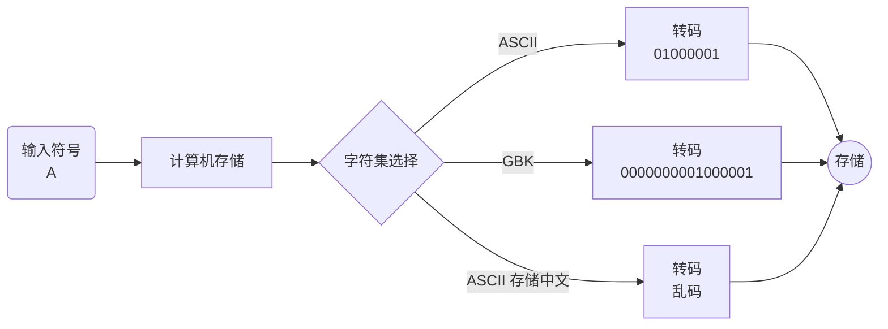
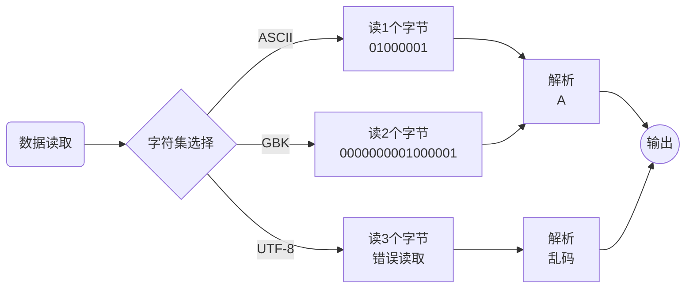
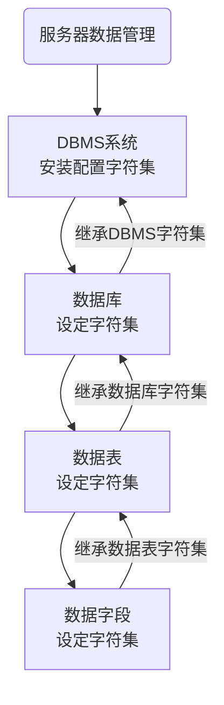
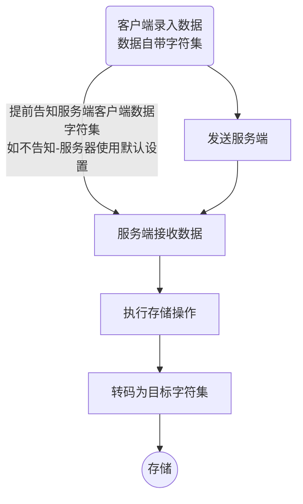
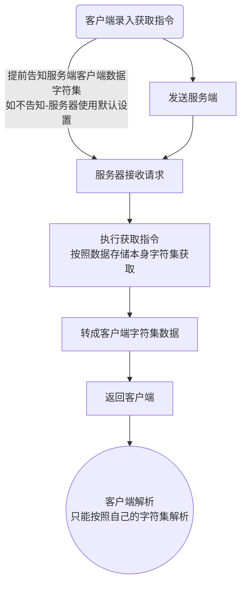
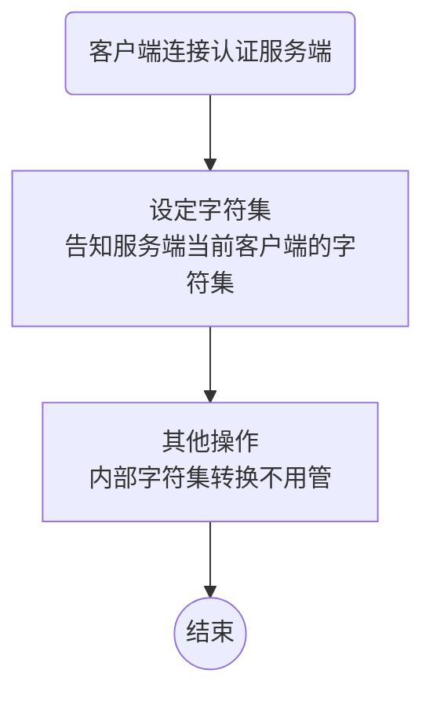

# 一、字符集


> 目标：了解字符集的概念，掌握MySQL数据库存储数据的字符集逻辑以及设置方式

* 字符集概念
* MySQL字符集关系
* 解决乱码问题
* 字符集设置原理


## 1、字符集概念

> 目标：了解字符集概念，掌握字符集存储和读取的实现原理


> 概念

**字符集**：charset或者character set，是各种文字和符号在计算机中的总称

* 字符集根据不同国家的符号不同，有不同的字符集
* 不同的字符集占用的存储空间不一样，存储的底层也不一样
* 不同字符集之间可以进行转换
* 常见字符集
  * ASCII：美国信息交换标准码，一般英文符号，一个字节存储
  * latin1：拉丁文字符集，一个字节存储，ISO-8859-1的别名 ，能够向下兼容ASCII
  * GB2312：信息交换用汉字编码字符集 ，是中国1981年的一套国标规范，2个字节存储
  * GBK：汉字内码扩展规范（1995年），两个字节表示表示（汉字很多超过5000个）
  * Unicode：万国码（统一码），使用统一的编码方式来解决传统的局限，1994年出现
  * UTF-8： 8-bit Unicode Transformation Format（万国码） ，针对Unicode的可变长度字符编码，采用1-6个字节编码Unicode字符（目前通用编码规则）。建议使用UTF-8字符集进行数据存储（MySQL8中建议使用utf8mb4）


> 示例

ASCII码表（单字节存储：1 byte = 8 bits）


>  原理流程图

1、数据存储




2、数据读取




> 小结

1、字符集是一套符号的总称

2、不同国家地区的符号有区别，所以有自己的字符集

3、常见的字符集目前是三个

* ASCII：美国信息交换标准码
* GBK：汉字内码扩展规范（国标），兼容ASCII
* UTF-8： 8字节万国码，兼容GBK和ASCII

4、目前基本都统一使用UTF-8开发和数据存储

5、字符集是指定字符的存储和读取的规范

* 指定的字符集存储需要使用对应的字符集读取
* 错误的字符集存储或者读取都会产生乱码


## 2、MySQL字符集

> 目标：了解MySQL中字符集的实现原理，掌握数据最终的存储字符集


> 概念

**MySQL字符集**：MySQL内部对于数据实际存储的字符集（服务器端）

* MySQL内部对象可以在各个层级设置字符集
* MySQL内部对象存在字符集继承：字段 -> 表 -> 数据库 -> DBMS
* MySQL内部内嵌支持几乎所有主流字符集
* 数据存储的最终字符集由字段控制
* 客户端与服务器进行交互时，需要明确告知服务器客户端自己的字符集（数据格式）


> 示例

查看MySQL支持的所有字符集

```mysql
show charset;
```


> 原理图

1、数据库内部对象字符集原理



1.1、服务端存储的数据最终字符集由字段确定

1.2、字段通常不会设置字符集，继承表的字符集（统一性，真正一般都与数据库一致）

1.3、数据存储的字符集与客户端的字符集没有直接关系，是由表（字段）决定


2、客户端存储数据原理




3、客户端读取数据原理




> 小结

1、MySQL服务端数据存储的字符集依赖各个对象设置

* DBMS：设置最广，一旦设置所有对象都可以依赖，但是优先级最低
* DB：针对数据库内的所有表，优先级高于DBMS，可以继承DBMS（一般在数据库层设置）
* Table：针对当前表的设置，优先级高于DB，可以继承DB
* Field：针对当前字段设置，优先级高于Table，可以继承Table，优先级最高

2、通常字符集的设置都是围绕数据表（现在都在数据库层），不会到具体字段

3、建议使用UTF8字符集存储数据（MySQL8以后建议使用UTF8MB4）

4、MySQL服务端支持各种字符集，并且能够进行各种字符集转换

5、客户端存储数据到服务端原理

* 客户端告知服务端客户端的字符集
* 服务端按照客户端指定的字符集接收数据（如果没有指定，使用默认，可能出现乱码）
* 服务端按照实际存储表对应的字符集进行转换
* 服务端存储数据

6、客户端读取服务端数据原理

* 客户端告知服务端客户端的字符集
* 服务端按照客户指定的指令从数据库读取原始字符集数据
* 服务端按照客户端的需求将数据进行字符转换
* 服务端发送目标数据给客户端
* 客户端按照自己的字符集进行解析


## 3、乱码问题解决

> 目标：了解乱码发生的原因，实现乱码问题的解决方案


> 概念

**乱码**：指数据不能按照正确的字符集进行存储或者解析

* 乱码原因1：数据在存储的时候已经变成乱码
  * 客户端字符集与服务端解析字符集不一致
  * 读取时想转成其他字符集均会错误
* 乱码原因2：数据存储时正确，但是读取时解析成错误字符集
  * 客户端能解析的字符集与服务器提供的字符集不一致
* 乱码解决方案：不论存储还是读取，都提前告知服务器当前客户端的字符集

```mysql
set names 客户端字符集;
```


> 示例

1、MySQL客户端（CMD打开），客户端字符集是固定的GBK

```mysql
set names gbk;
```


> 流程图




> 小结

1、乱码的本质原因就是客户端与服务端的字符集不一致导致

* 客户端存储数据的时候服务端没有正确理解（服务端按照默认的存储，存储的就是乱码）
* 客户端读取的时候没有正确告知服务端（服务端按照默认的提供）

2、解决乱码问题的方案：保证服务端正确理解客户端的字符集

* set names 客户端字符集
* 在任何数据操作之前（尤其是写数据，包括结构）


## 4、字符集设置原理

> 目标：了解set names 字符集的本质原理


> 概念

**字符集设置原理**：服务器端正确保障对客户端的数据识别

* MySQL服务端提供了变量来记录客户端的字符集
* MySQL对应的存储字符集的变量可以修改
* `set names 字符集`就是对变量的修改，总共有三个
  * character_set_client：客户端提供的数据的字符集
  * character_set_results：客户端需要服务端提供的数据的字符集
  * character_set_connection：连接使用的字符集，内部数据操作


> 示例

1、查看系统内部存储这些记录字符集的信息

```mysql
show variables like 'character_set%';	#%表示通配符，匹配后续所有不确定的数据
```


2、修改客户端字符集变量，保证数据正常存进服务端

```mysql
set character_set_client = gbk;
```


3、修改客户端解析字符集变量，保证数据正常被客户端查看

```mysql
set character_set_results = gbk;
```


4、使用set names 字符集批量修改，保证客户端被服务端正确理解，同时客户端也能正确解析

```mysql
set names gbk;
```


> 小结

1、MySQL字符集控制是在服务端内部通过变量连接（针对每个独立的客户端）

2、set names字符集是一种快捷方式，本质有三个变量被修改

* character_set_client：服务端接收客户端数据
* character_set_connection：服务端内部连接使用
* character_set_results：服务端提供数据给客户端

3、通常我们都是使用set names字符集来进行统一设置，而且是在**建立连接之后操作数据之前就设置**


## 5、总结


1、字符集是所有编程语言里都必须面对的首要问题，必须在一开始就选择好字符集（去到企业后先问清楚）

* 业务针对的符号
* 业务针对的范围

2、乱码是编程中最基础要解决的问题，一旦数据产生了乱码，通常是不可逆操作

3、解决乱码问题其实本质就是统一字符集问题

* 客户端字符集：`character_set_client`
* 连接层字符集：`character_set_connection`
* 结果集字符集：`character_set_results`
* 简单统一方式：`set names 客户端字符集`
* 存储字符集：不用考虑，因为数据库有强大的字符集转换能力，只要在开始设置好，保证后续数据不会超出字符集即可


# 二、校对集

> 目标：了解校对集的概念以及校对集在校对时的作用

* 校对集概念
* 校对集设置
* 校对应用


## 1、校对集概念

> 目标：了解校对集的概念和作用


> 概念

**校对集**：collate/collation，即数据比较时对应的规则

* 校对集依赖字符集
* 校对集的校对方式分为三种
  * 大小写不敏感：\_ci，case insensitive（不区分大小写）
  * 大小写敏感：\_cs，case sensitive（区分大小写）
  * 二进制比较：\_bin，binary（区分大小写）
* 校对集是在进行数据比较的时候触发


> 示例

1、\_ci，大小写不敏感

```txt
A 与 a 是相同的，不存在谁大谁小（系统会转换成一种）
```


2、\_cs，大小写敏感

```txt
A 与 a 有大小关系，所以不同（存储数值）
```


3、\_bin，二进制比较

```txt
A的二进制是01000001
a的二进制是01100001
二进制按位比较，所以不同
```


> 小结

1、校对集是数据比较的规则

* 校对集依赖字符集存在

* 每个字符集有多种校对规则

2、校对规则一共有三种

* \_ci：大小写不敏感，不区分大小写
* \_cs：大小写敏感，区分大小写
* \_bin：二进制比较（区分大小写）


## 2、校对集设置

> 目标：了解MySQL中校对集的设计方式以及规则查看


> 概念

**校对集设置**：在创建数据表的时候创建校对规则

* 校对规则可以在MySQL四层对象设计
  * DBMS：系统配置
  * DB：数据库指定（库选项）
  * Table：表指定（表选项）
  * Field：字段指定（字段选项，一般不用）
* 校对集从Field到DBMS继承；优先级Field最高
* 每个校对集都有字符集对应的默认规则
* 校对集设置语法

```mysql
collate 校对集规则;
```


> 示例

1、查看MySQL支持的所有校对集

```mysql
show collation;
```


2、在数据库层设计校对集（常见）

```mysql
create database db_4 charset utf8mb4 collate utf8mb4_bin;
```


3、在数据表层设计校对集

```mysql
create table t_4(
	id int,
    name varchar(10)
)charset utf8mb4 collate utf8mb4_bin;
```


4、在字段层设计校对集（一般不常用）

```mysql
create table t_5(
	id int,
    name varchar(10) collate utf8mb4_bin
)charset utf8mb4;
```


> 小结

1、MySQL中四层对象都可以设置校对集

* DBMS：配置文件
* DB：创建数据库时限定（设置）
* Table：创建表示限定
* Field：创建字段时限定

2、校对集从Field到DBMS实现继承

3、校对集依赖字符集，且每个字符集都有默认的校对集（一般情况不需要设置）


## 3、校对集应用

> 目标：了解不同校对集的实际校对原理，掌握校对规则的应用场景


> 概念

**校对集应用**：触发校对规则的使用

* 校对集的应用通常是通过**数据比较**触发：`order by 字段`
* 数据表中数据一旦产生，校对集的修改就无效


> 示例

1、创建校对规则数据表并插入数据

```mysql
# 创建默认校对规则表（不区分大小写）
create table t_4(
	name varchar(1)
)charset utf8mb4;
insert into t_4 values('B');
insert into t_4 values('A');
insert into t_4 values('b');
insert into t_4 values('a');

# 创建二进制校对规则（区分大小写）
create table t_5(
	name varchar(1)
)charset utf8mb4 collate utf8mb4_bin;
insert into t_5 values('B');
insert into t_5 values('A');
insert into t_5 values('b');
insert into t_5 values('a');
```


2、触发校对：排序 order by

```mysql
select * from t_4 order by name; # 升序
select * from t_5 order by name;
```


3、数据已经存在的表重新修改校对规则无效

```mysql
alter table t_5 collate utf8mb4_general_ci;
```


> 小结

1、校对集的应用不是主动触发，而是通过数据比较自动触发

2、校对集对应的数据一旦产生，那么就不可以修改数据表的校对规则

3、校对集通常使用字符集默认校对集，如果需要进行额外的比较应用（通常是区分大小写），那么需要在建表的时候设定好目标校对规则


## 4、总结


1、校对集是数据比较的标准

2、校对集的校对规则都是依赖字符集存在的，不外乎三种规则

* \_ci：不区分大小写
* \_cs：区分大小写
* \_bin：二进制比较（区分大小写）

3、校对集的触发是自动的，只要数据在进行比较的时候就会自动触发设定的校对规则

* 校对集的维护要在数据产生之前
* 数据产生之后校对集的修改将无效

4、在进行数据表设计之前，要提前了解数据后续可能产生的比较形态，选择好合适的校对规则（一般都默认不区分大小写）