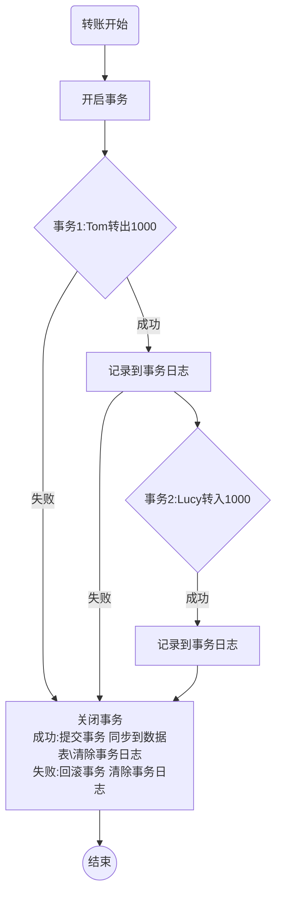
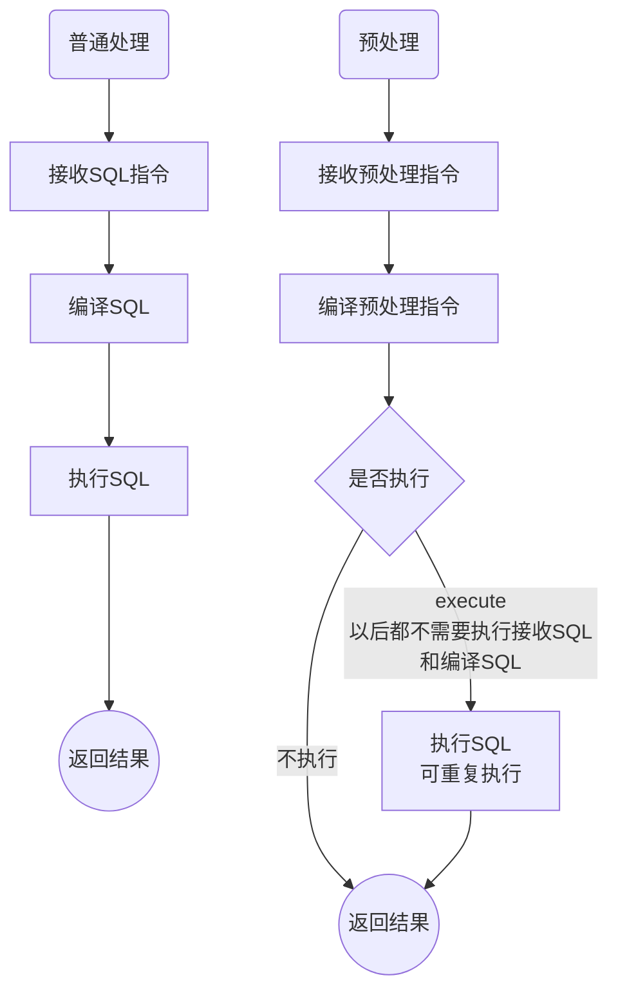

# MySQL安全管理

> 学习目标：了解MySQL中涉及安全的管理方式、以及各种安全管理的概念和使用方式、使用场景

* 外键约束
* 事务管理
* 预处理
* 视图
* 数据备份与还原
* 用户管理


> 概念

**安全管理**：用各种方式来确保数据库的安全和数据的安全


> 示例

携程的数据库被程序员删库跑路...


* 如果有用户管理，那么可以通过权限限制其没有权限删除
* 如果有数据备份，即便数据删除，也可以很快的实现数据还原，减小损失
* ...


> 小结

1、安全管理是每一个接触数据库的人都应该考虑的问题，尤其是DBA（数据库管理员）

2、数据库安全的维度有很多

* 管理安全：用户、权限、备份还原等
* 结构安全：外键、视图、事务等
* 执行层：预处理


## 一、外键约束

> 目标：了解外键的概念和意义，掌握外键约束的管理和实际的应用场景

* 外键
* 外键约束
* 外键管理


### 1、外键

> 目标：认识外键，了解外键的构成条件


> 概念

**外键**：foreign key，表中指**向外部表主键**的字段定义成外键

* 外键必须要通过语法指定才能称之为外键
  * [constraint`外键名`] foreign key(当前表字段名) references 外部表(主键字段)
* 外键构成条件
  * 外键字段必须与对应表的主键字段类型一致
  * 外键字段本身要求是一个索引（创建外键会自动生成一个索引）


> 步骤

1、确定表中字段与另外一张表存在关联关系

2、使用外键明确关联外表

3、外键约束成功


> 示例

1、创建专业表和学生表，学生表中的专业id指向专业表id

```mysql
create table t_47(
	id int primary key auto_increment,
    name varchar(50) not null unique
)charset utf8;

create table t_48(
	id int primary key auto_increment,
    name varchar(50) not null,
    c_id int comment '指向t_46表中的id主键',
    constraint `c_id` foreign key(c_id) references t_47(id)
)charset utf8;
```


2、外键可以不指定名字，系统会自动生成

```mysql
create table t_49(
	id int primary key auto_increment,
    name varchar(50) not null,
    c_id int,
    foreign key(c_id) references t_47(id)
)charset utf8;
```


> 小结

1、外键是需要保证字段与外部连接的主键字段一致的

2、一张表可以有多个外键，但是一个字段只能产生一个外键


### 2、外键约束

> 目标：了解外键的意义，掌握外键的约束控制和约束作用


> 概念

**外键约束**：当表建立外键关系后，外键就会对主表（外键指向的表）和子表（外键所在的表）里的数据产生约束效果

* 外键约束的是写操作（默认操作）
  * 新增：子表插入的数据对应的外键必须在主表存在
  * 修改：主表的记录如果在子表存在，那么主表的主键不能修改（主键不能修改）
  * 删除：主表的记录如果在子表存在，那么主表的主键不能删除
  * 删除：主表的记录如果在子表存在，那么主表的主键不能删除
* 外键约束控制：外键可以在定义时控制外键的约束作用
  * 控制类型
    * on update：父表更新时子表的表现
    * on delete：父表删除时子表的表现
  * 控制方式
    * cascade：级联操作，父表操作后子表跟随操作
    * set null：置空操作，父表操作后，子表关联的外键字段置空
    * restrict：严格模式，不允许父表操作（默认的）
    * no action：子表不管


> 步骤

1、确定表的外键关联关系

2、确定主表的约束控制

3、明确使用相应的约束控制

4、系统自动约束


> 示例

1、子表不能插入主表不存在的数据

```mysql
insert into t_48 values(null,'Tony',2);	# 错误

insert into t_47 values(null,'English');
insert into t_48 values(null,'Peny',1);
```


2、默认的外键产生后，主键不能更新被关联的主键字段或者删除被关联的主键记录

```mysql
# 错误
update t_47 set id = 2;
delete from t_47 where id = 1;
```


3、限制外键约束，一般使用更新级联，删除置空

* on update cascade：更新级联
* on delete set null：删除置空

```mysql
create table t_50(
	id int primary key auto_increment,
    name varchar(50) not null unique
)charset utf8;

create table t_51(
	id int primary key auto_increment,
    name varchar(50) not null,
    c_id int, # 如果要允许置空，就不能not null
    foreign key(c_id) references t_50(id) on update cascade on delete set null
)charset utf8;

insert into t_50 values(null,'Chinese'),(null,'Computer');
insert into t_51 values(null,'Tony',1),(null,'Petter',2);
```


* 子表依然不允许插入父表不存在的外键
* 但是可以插入外键为Null的数据

```mysql
# 错误
insert into t_51 values(null,'Lilei',3);

insert into t_51 values(null,'Lilei',NULL); # OK                               
```

* 父表的更新（主键）会让关联的外键自动级联更新

```mysql
update t_50 set id = 3 where id = 1;
```

* 父表的删除会让关联的外键自动自动置空

```mysql
delete from t_50 where id = 3;
```


> 小结

1、外键约束对子表和父表都有约束

* 子表约束：子表不能插入父表不存在的外键
* 父表约束
  * 更新约束（默认不允许）
  * 删除约束（默认不允许）
* 一般约束
  * 级联更新
  * 删除置空

2、外键约束增强了数据的安全性和可靠性，但是会增加程序对于数据的不可控性，所以是实际开发中一般会通过程序逻辑控制来保证数据的完整性和安全性，外间使用较少


### 3、外键管理

> 目标：了解外键的维护


> 概念

**外键管理**：在表创建后期维护外键

* 新增外键

```mysql
alter table 表名 add [constraint `外建名`] foreign key(外键字段) references 表名(主键) [on 外键约束]
```

* 删除外键

```mysql
alter table 表名 drop foreign key 外键名;
```

* 更新外键：先删除后新增


> 示例

1、删除外键

```mysql
alter table t_51 drop foreign key t_51_ibfk_1;	# 系统生成的外键
```


2、追加外键

```mysql
alter table t_51 add constraint `t_51_50` foreign key(c_id) references t_50(id);
```

* 注意：追加外键需要保证外键字段里的值要么为Null，要么在父表中都能找到


> 小结

1、外键的使用最好的创建表结构的时候就维护好，后期的维护对子表数据有要求


## 二、事务安全

> 学习目标：了解事务安全的概念和特性，掌握事务安全的应用，能够使用事务安全解决相应问题

* 事务概念
* 事务处理
* 事务特点


### 1、事务

> 目标：认识事务，了解事务的原理和作用


> 概念

**事务**：要做的某个事情

* 计算机中的事务是指某个程序执行单元（写操作）
* 事务安全：当事务执行后，保障事务的执行是有效的，而不会导致数据错乱
* 事务安全通常针对的是一连串操作（多个事务）而产生的统一结果


* MySQL中默认的写操作是直接写入的
  * 执行写操作SQL
  * 同步到数据表


> 示例

银行转账：从A账户转账到B账户

创建数据表

```mysql
create table t_52(
	id int primary key auto_increment,
    name varchar(50) not null,
    account decimal(10,2) default 0.00
)charset utf8;

insert into t_52 values(null,'Tom',10000),(null,'Lucy',100);
```


转账：Tom向Lucy转账，一定是分为两步

```mysql
# Tom扣钱
update t_52 set account = account - 1000 where id = 1;

# Lucy收钱
update t_52 set account = account + 1000 where id = 2;
```

* 以上两步必须都成功转账才能叫成功
* 两步操作无法确保哪一步会出问题（尤其是第二步）
* 为了保障两步都成功才能叫事务安全


> 事务安全原理

事务安全是在操作前告知系统，接下来所有的操作都暂**不同步到数据表**，而是记录到**事务日志**，指导后续所有操作都成功，再进行同步；否则取消所有操作


以上述转账为例




> 小结

1、事务的目的就是为了保障连续操作的一致性，保证结果的完整性

2、事务的原理是通过将操作结果暂时保存在事务日志中，等所有操作的结果都是成功的，然后一并同步到数据表


### 2、事务处理

> 目标：掌握事务的手动实现和自动实现


> 概念

**事务处理**：利用自动或者手动方式实现事务管理

* 自动事务处理：系统默认，操作结束直接同步到数据表（事务关闭状态）
  * 系统控制：变量 autocommit（值为ON，自动提交）
* 手动事务处理
  * 开启事务： `start transaction`
  * 关闭事务
    * 提交事务：`commit`（同步到数据表同时清空日志数据）
    * 回滚事务：`rollback`（清空日志数据）
* 事务回滚：在长事务执行中，可以在某个已经成功的节点处设置回滚点，后续回滚的话可以回到某个成功点
  * 设置回滚点：`savepoint 回滚点名字`
  * 回滚到回滚点：`rollback to 回滚点名字`


> 步骤

1、确定操作需要使用到事务操作

2、开启事务

3、执行事务

* 如果需要回滚点设置：设置回滚点
* 如果需要回滚：回滚到回滚点

4、结束事务

* 成功提交事务：同步到数据表，清空事务日志
* 失败回滚事务：清空事务日志


> 示例

1、手动事务：启用事务转账，成功提交事务

```mysql
# 开启事务
start transaction;

# Tom扣钱
update t_52 set account = account - 1000 where id  = 1;

# Lucy收钱
update t_52 set account = account + 1000 where id  = 2;

# 提交事务
commit;
```


2、手动事务：启用事务转账，成功提交事务（回滚点）

```mysql
# 开启事务
start transaction;

# Tom扣钱
update t_52 set account = account - 1000 where id= 1;

# 设置回滚点
savepoint sp1;

# Lucy收钱
update t_52 set account = account + 10000 where id= 2;

# 操作失败回到回滚点
rollback to sp1;

# Lucy收钱
update t_52 set account = account + 1000 where id= 2;

# 提交事务
commit;
```


3、自动事务

* Mysql默认是自动提交事务的：所以事务一旦发生就会立即写入到数据表（不能多个事务一起完成任务）

```mysql
show variables like 'autocommit';
```

* 关闭自动提交事务（当前设置级别用户级：当前用户档次连接有效）

```mysql
set autocommit = 0;	
```

* 手动提交事务

```mysql
insert into t_52 values(null,'Liu',1000);
commit;
```


> 小结

1、事务处理要应用到多次写操作组成的大事务中，如金融安全等

2、事务处理通常都会使用手动控制事务，没必要去修改原本的自动提交的机制，开启所有事务

3、扩展：事务处理的支持是有条件的

* 存储引擎需要为InnoDB


### 3、事务特点

> 目标：理解事务的特点


> 概念

**事务特点**：事务处理具有ACID四大特性

* 原子性（Atomicity ）：一个事务操作是一个整体，不可拆分，要么都成功，要么都失败
* 一致性（Consistency）：事务执行之前和执行之后都必须处于一致性状态，数据的完整性没有被破坏（事务逻辑的准确性）
* 隔离性（Isolation ）：事务操作过程中，其他事务不可见
* 持久性（Durability ）：事务一旦提交，结果不可改变


> 小结

1、事务特点需要在对应事务操作时，结合多个用户来看才能看的完整和亲切

2、扩展

* **事务锁**：当一个事务开启时，另外一个事务是不能对当前事务锁占用的数据进行操作的
  * 行所：当前事务只占用了一行（id精确检索数据），那么其他事务可以操作其他行数据
  * 表所：当前事务占用了整张表（like扫码整个表），那么其他事务对整张表都不能操作
* **脏读**：一个事务在对某个数据进行操作但尚未提交，而另外一个事务读到了这个“历史”数据其实已经被修改


## 三、预处理

> 学习目标：了解预处理的概念，掌握预处理的使用方式，理解预处理的作用

* 预处理
* 预处理传参


### 1、预处理

> 目标：了解预处理的概念，掌握预处理的基本处理方式和应用场景


> 概念

**预处理**：prepare statement，一种预先编译SQL指令的方式（然后命令执行）

* 预处理不同于直接处理，是将要执行的SQL指令先发送给服务器编译，然后通过指令执行
  * 发送预处理：`prepare 预处理名字 from '要执行的SQL指令'`
  * 执行预处理：`execute 预处理名字`
* 预处理管理
  * 预处理属于**会话级别**：即当前用户当次连接有效（断开会被服务器清理掉）
  * 删除预处理：`deallocate | drop prepare 预处理名字`


> 步骤

1、要执行的SQL指令想使用预处理

* 重复执行的指令
* 涉及数据安全的指令

2、发送预处理指令

3、执行预处理


> 示例

1、查询学生的SQL指令需要重复执行很多次

```mysql
# 普通操作
select * from t_42;

# 预处理操作：发送预处理
prepare p1 from 'select * from t_42';

# 预处理操作：执行预处理
execute p1;

# 删除预处理
deallocate  prepare p1;
```


> 预处理原理

普通处理和预处理对比




> 小结

1、预处理就是把要执行的结构（SQL指令）提前发送给服务器端，服务器进行编译但不执行，等待执行指令后才执行

2、预处理的作用

* 性能优化
  * 效率优化：同样的SQL不用每次都进行编译（编译耗时）
    * 普通处理：每次都需要编译
    * 预处理：编译一次
  * 网络传输优化：复杂的SQL指令只需要传输一次
    * 普通处理：每次都需要网络传输SQL指令
    * 预处理：传输一次SQL指令，以后都是执行指令
* 安全：有效防止SQL注入（外部通过数据的特殊使用使得SQL的执行方式改变）
  * 普通处理：直接发送给服务器执行（容易出现SQL注入）
  * 预处理：发送的是结构，数据是后期执行传入（传入协议不一样，数据安全性高）


### 2、预处理传参

> 目标：了解预处理的参数处理模式，理解预处理传参的意义


> 概念

**预处理传参**：在执行预处理的时候传入**预处理需要的可变数据**

* 一般预处理都不会是固定死的SQL指令，而是具有一些数据可变的执行（条件）

  * 可变数据的位置使用占位符 `?` 占位

  ```mysql
  prepare 预处理名字 from `预处理指令 变化部分使用?替代`
  ```

* 在执行预处理的时候将实际数据传进去代替占位符执行SQL

  * 数据存储到变量（预处理传入的值必须是变量保存的）

  ```mysql
  set @变量名 = 值
  ```

  * 使用using关键字传参

  ```mysql
  execute 预处理名字 using @变量名
  ```

  * 数据传入的顺序与预处理中占位符的顺序一致


> 步骤

1、同样的SQL指令要执行N次，但是条件不一致

2、使用预处理占位符发送预处理指令

3、设定变量保存要传入的数据

4、执行预处理，携带变量参数


> 示例

向t_40表中插入数据

```mysql
# 准备预处理：涉及参数
prepare t_40_insert from 'insert into t_40 values(null,?,?,?,?)';

# 设置变量并传入参数
set @name = '药师兜';
set @gender = '男';
set @age = 23;
set @class_name = '木叶1班';

# 执行预处理
execute t_40_insert using @name,@gender,@age,@class_name;
```


> 小结

1、预处理传参是实际应用预处理时最常见的方式

2、预处理指令可以适用于增删改查各种指令

3、如果预处理的指令不是在一次连接中重复使用，那么预处理反而会降低效率。所以预处理的执行如果不是考虑到安全因素，那么一定是SQL需要重复执行


## 四、视图

> 学习目标：了解视图的概念，理解视图的作用和应用场景，能够熟练的使用视图来解决相应需求问题

* 视图概念
* 视图管理
* 视图数据操作
* 视图算法


### 1、视图

> 目标：了解视图的概念，掌握视图的创建和访问


> 概念

**视图**：view，一种由select指令组成的**虚拟表**

* 视图是虚拟表，可以使用表管理（结构管理）
  * 为视图提供数据的表叫做基表

```mysql
# 创建视图
create view 视图名字 as select指令;

# 访问视图：一般都是查询
select */字段名 from 视图名字;
```

* 视图有结构，但不存储数据
  * 结构：select选择的字段
  * 数据：访问视图时执行的select指令


> 步骤

1、确定需要使用视图提供数据

* 数据来源是多张表
* 对外部系统提供数据支撑（保护基表数据）

2、使用视图


> 示例

1、需要对外提供一个学生详情的数据，经常使用：可以利用视图实现

```mysql
# 对外提供数据，要保护数据本身的安全
# 需要长期使用

# 创建视图
create view v_student_info as select * from t_45 left join t_46 using(c_id);
# 使用视图：像表一样使用
select * from v_student_info;
```


2、有些复杂的SQL又是经常用到的，如多张表的连表操作：可以利用视图实现

```mysql
# 院系表
create table t_53(
	id int primary key auto_increment,
    name varchar(50) not null
)charset utf8;
insert into t_53 values(null,'语言系'),(null,'考古系');

# 专业表
create table t_54(
    id int primary key auto_increment,
    name varchar(50) not null,
    s_id int not null comment '学院id'
)charset utf8;
insert into t_54 values(null,'English',1),(null,'Chinese',1);

# 学生表
create table t_55(
	id int primary key auto_increment,
    name varchar(50) not null,
    s_id int not null comment '专业Id'
)charset utf8;
insert into t_55 values(null,'Lilei',2),(null,'Mark',2),(null,'Tony',1);

# 获取所有学生的明细信息
select stu.*,sub.name as sub_name,sub.s_id as sch_id,sch.name as sch_name from t_55 as stu left join t_54 sub on stu.s_id = sub.id left join t_53 sch on sub.s_id = sch.id;

# 以视图保存这类复杂指令，后续可以直接访问视图
create view v_student_detail as select stu.*,sub.name as sub_name,sub.s_id as sch_id,sch.name as sch_name from t_55 as stu left join t_54 sub on stu.s_id = sub.id left join t_53 sch on sub.s_id = sch.id;

select * from v_student_detail;
```


> 小结

1、视图是用来提供数据支持的，是由select指令组成的结构

* 存在结构
* 不存在数据（数据是使用时调用select指令动态获取数据）

2、视图的目的

* 方便提供全面数据：可以根据需求组织数据，而实际上不会在数据库产生数据冗余
* 数据安全：视图本质是来源于数据基表，但是对外可以保护基本的数据结构


### 2、视图管理

> 目标：了解视图的结构管理


> 概念

**视图管理**：对视图结构的管理

* 视图查看：显示视图结构和具体视图信息

```mysql
show tables;	# 查看全部视图
show create table/view 视图名字;	# 查看视图创建指令
desc 视图名字;	 # 查看视图结构
```

* 视图修改：更改视图逻辑

```mysql
# 更改视图
alter view 视图名 as 新的查询指令;
create or replace view 视图名 as 新的查询指令;	# 创建新的或者替换新的
```

* 视图删除

```mysql
drop view 视图名; 
```


> 示例

1、查看全部视图和视图明细

```mysql
show tables;	# 查看全部表，包括视图
desc v_student_detail;	# 查看视图结构
show create view v_student_detail;	# 查看视图创建明细
```


2、修改视图：重置视图数据逻辑

```mysql
alter view v_student_info as select t1.s_name,t2.c_name from t_45 t1 left join t_46 t2 using(c_id);
create or replace view v_student_info as select t1.s_name,t2.c_name from t_45 t1 left join t_46 t2 using(c_id);
```


3、删除视图

```mysql
drop view v_student_info;
```


> 小结

1、视图操作与表操作类似，通常情况下不会经常的去修改维护，而是会在一开始就维护好

2、视图管理可以与表一样对结构进行管理


### 3、视图数据操作

> 目标：了解视图数据操作的概念以及操作原理，掌握视图实现基表数据的操作


> 概念

**视图数据操作**：直接对视图进行写操作（增删改）然后实现基表数据的变化

* 视图所有的数据操作都是最终对基表的数据操作
* 视图操作条件
  * 多基表视图：不允许操作（增删改都不行）
  * 单基表视图：允许增删改
    * 新增条件：视图的字段必须包含基表中所有不允许为空的字段
  * with check option：操作检查规则
    * 默认不需要这个规则（创建视图时指定）：视图操作只要满足前面上述条件即可
    * 增加此规则：视图的数据操作后，必须要保证该视图还能把通过视图操作的数据查出来（否则失败）


> 步骤

1、根据需求确定需要使用视图

2、确定允许视图进行数据操作（通常用户权限设定，且是单基表视图）

3、确定视图数据的操作是否需要操作检查（有where条件筛选，且只对新增和更新有影响）

* 需要：增加with check option
* 不需要

4、使用视图进行数据操作（最终数据写落点是基表）


> 示例

1、增加一个单表视图和多表视图

```mysql
create view v_student_1 as select s_id,s_name from t_45;
create view v_student_2 as select s.*,c.c_name from t_45 s left join t_46 c using(c_id);
create or replace view v_student_3 as select * from t_45 where c_id is not null with check option;
```


2、新增数据

```mysql
insert into v_student_1 values(null,'student7');	# 正确：视图包含所有必有字段
insert into v_student_2 values(null,'student8',null,null); # 错误：不可插入
insert into v_student_3 values(null,'student8',null);	# 错误：check option，因为第三个字段c_id为NULL，不符合视图筛选条件，查不出来
insert into v_student_3 values(null,'Student9',1);	# 正确
```


3、更新数据

```mysql
update v_student_1 set s_name = 'boy' where s_id = 8;
update v_student_2 set s_name = 'boy' where s_id = 7; # 错误：不可修改
update v_student_3 set c_id = null where s_id = 1;	  # 错误：check option，修改后c_id为null，变得不符合视图筛选条件了
update v_student_3 set s_name = 'boy' where s_id = 1; # 正确
```


4、删除数据

```mysql
delete from v_student_1 where s_id = 2;
delete from v_student_2 where s_id = 3;	# 错误：不可删除
delete from v_student_3 where s_id = 1;	# 可以删除，说明with check option不影响删除操作
```


> 小结

1、视图数据操作一般情况下是不允许的，通常之所以对外提供视图就提供数据的只读操作

2、视图数据操作与视图的基表数量和字段有关

* 多基表视图不允许任何写操作
* 单基表视图允许更新和删除、根据情况允许新增（视图包含基表中所有不允许为空字段）

3、with check option是针对有where条件的视图组成有效，需要手动选择是否增加该选项

* 视图数据的新增、修改后，必须与原来的查询结果是一致的（新增一定要能在视图中看到）
* 视图数据的删除不受with check option影响
* 视图数据的新增、修改都是针对当前视图能查出来的，否则既不报错也不生效
* with check option还可以更复杂，如果有兴趣可以深入的了解一下


### 4、视图算法

> 目标：了解视图算法的概念和作用，理解各个视图算法的意义


> 概念

**视图算法**：指视图在执行过程中对于内部的select指令的处理方式

* 视图算法在创建视图时指定

```mysql
create ALGORITHM = 算法 view 视图名字 as select指令;
```

* 视图算法一共有三种
  * undefined：默认的，未定义算法，即系统自动选择算法
  * merge：合并算法，就是将视图外部查询语句跟视图内部select语句合并后执行，效率高（系统优先选择）
  * temptable：临时表算法，即系统将视图的select语句查出来先得出一张临时表，然后外部再查询（temptable算法视图不允许写操作）


> 步骤

1、确定使用视图

2、确定视图算法：考虑视图内部SQL指令中的子句使用情况

3、创建视图并使用视图


> 示例

1、创建三种不同算法视图

```mysql
create algorithm = undefined view v_student_4 as select * from t_42 order by age desc;
create algorithm = merge view v_student_5 as select * from t_42 order by age desc;
create algorithm = temptable view v_student_6 as select * from t_42 order by age desc;
```


2、使用视图：为了体现算法效果，给视图增加分组效果

```mysql
select count(*),any_value(name),any_value(age),class_name,max(age) from v_student_4 group by class_name;
select count(*),any_value(name),any_value(age),class_name,max(age) from v_student_5 group by class_name;
select count(*),any_value(name),any_value(age),class_name,max(age) from v_student_6 group by class_name;
```


3、临时表算法的视图不能进行数据插入操作

```mysql
insert into v_student_6 values(null,'冥加','男',100,'神妖1班'); # 错误：不可插入
```


> 小结

1、视图算法是用来结合外部外的查询指令的优化思路，主要的优化方式有两种

* merge：合并算法，将视图的select与外部select合并成一条，然后执行一次（效率高）
* temptable：临时表算法，视图的指令单独执行得到一个二维表，然后外部select再执行（安全）
* undefined：未定义算法是一种系统自动选择的算法，系统偏向于选择merge算法

2、一般在设计视图的时候要考虑到视图算法的可行性，通常视图中如果出现了order by排序的话，就要考虑使用temptable算法

* 只要merge以后，不会导致数据因为子句的先后顺序而混乱（order by与group by的顺序混乱容易出问题）


## 五、数据备份与还原

> 学习目标：了解数据备份与还原的重要性，掌握数据备份与还原的几种方式及其优缺点，能够对不同的数据备份需求提出相应的解决方案

* 单表数据备份与还原

* 文件备份与还原
* SQL备份与还原


> 概念

**备份**：backup，将数据或者结构按照一定的格式存储到另外一个文件中，以保障阶段数据的完整性和安全性

* 将当前正确数据进行数据保存
* 备份通常是有固定的时间节点

**还原**：restore，在当前数据出问题的情况下，将之前备份的数据替换掉当前数据，保证系统的持续、正确的运行

* 基于备份进行数据还原
* 备份还原不一定能够保证所有损失挽回


> 小结

1、数据的备份与还原是作为一个正常运行的数据库必须做的事情

* 确保数据的安全
* 将数据出错的风险降低到最小

2、数据库的备份与还原是作为一个DBA最基本的技术要求（开发者也要会）


### 1、表数据备份

> 目标：了解表数据备份概念，了解表备份数据的应用场景


> 概念

**表数据备份**：单独针对表里的**数据部分**进行备份（数据导出）

* 将数据从表中查出，按照一定格式存储到外部文件
  * 字段格式化：fields
    * terminated by：字段数据结束后使用的符号，默认是空格
    * enclosed by：字段数据包裹，默认什么都没有
    * escaped by：特殊字符的处理，默认是转义
  * 行格式化：lines
    * terminated by：行结束符号，默认是\n，自动换行
    * starting by：行开始符号，默认没有

```mysql
select 字段列表|*  into outfile 外部文件路径 
	[fields terminated by 格式 enclosed by 格式]
	[lines terminated by 格式 starting by 格式]
from 数据表;
```

* 表数据备份不限定数据的来源是一张表还是多张表（可以连表）


> 步骤

1、确定需要对表数据进行导出处理（备份），而且不需要考虑字段名字

2、确定导出的数据的处理

* 字段处理（可以默认）
* 行处理（可以默认）

3、执行表数据导出


> 示例

1、将t_40表的数据按照默认的方式导出到文件

```mysql
select * into outfile  'D:/t_40.csv' from t_40;
```

* 如果系统提示：secure-file-priv问题，说明配置没有允许进行文件的导入导出。需要在配置文件里（my.ini）配置好这个配置项：secure-file-priv = 数据导入导出路径/不指定值（重启MySQL生效）


2、将t_40表的数据按照指定格式导出到文件

```mysql
select name,gender,age,class_name into outfile 'D:/t_40_self.csv'
	fields terminated by '-' enclosed by '"'
	lines starting by 'GO:'
from t_40;
```


3、多表数据导出：t_45连接t_46表

```mysql
select * into outfile 'D:/t_45_46.csv' from t_45 left join t_46 using(c_id);
```


> 小结

1、表数据备份是一种将表中的数据按照一定的格式导出到外部文件进行保存

* 数据取出后方便进行加工管理
* SQL有不同的语法，但是数据的识别是一致的，所以方便进行数据库间的切换

2、表数据备份通常是为了进行数据加工后存入回表中，或者到其他表

3、目前比较少用这种方式进行数据备份


### 2、表数据还原

> 目标：了解表数据还原的概念，了解表数据还原所能解决的问题


> 概念

**表数据还原**：将**符合数据表结构**的数据导入到数据表中（数据导入）

* 将一定格式的数据按照一定的解析方式解析成符合表字段格式的数据导入到数据表
  * 字段处理
  * 行处理

```mysql
load data infile '数据文件所在路径' into table 表名
	[fields terminated by 格式 enclosed by 格式]
	[lines terminated by 格式 starting by 格式]
	[(字段列表)];	# 如果是部分表字段，那么必须将字段列表放到最后
```

* 数据文件来源
  * 表数据备份的数据文件
  * 外部获取或者制作的符合格式的数据


> 步骤

1、数据文件里的数据满足数据表的字段要求

* 数据类型
* 字段对应数（自增长id、可以为空字段除外）

2、数据文件里的数据可以通过字段加工、行加工处理满足表字段要求

3、使用数据导入


> 示例

1、将t_40.csv数据导入到db_3数据库中的一个与t_40表结构一致的表中

```mysql
create table t_40 like db_2.t_40;

load data infile 'D:/t_40.csv' into table t_40; # 有可能因为字符集出现问题           
load data infile 'D:/t_40.csv' into table t_40 charset utf8; 
```

**注意**：数据加载的时候需要注意外部数据的字符集，在加载的时候需要指定字符集为外部文件数据格式，在表后增加字符集`charset 外部文件数据字符集`


2、将t_40_self文件里的数据导入到db_3.t_40表中

```mysql
load data infile 'D:/t_40_self.csv' into table t_40 charset utf8 fields terminated by '-' enclosed by '"' lines starting by 'GO:' (name,gender,age,class_name) ;
```


> 小结

1、表数据还原其实是将外部符合条件的数据，按照一定的格式要求导入到数据表中

2、数据导入可以解决不同格式数据或者不同数据库产品间的数据互相导入到对应数据库产品的问题

3、目前较少使用这种方式进行数据导入：数据的生成应该是业务产生，而不是人工参与（破坏数据的客观有效性，使得数据不真实）


### 3、文件备份

> 目标：了解文件备份的概念和原理


> 概念

**文件备份**：直接对数据表进行文件保留，属于物理备份

* 文件备份操作简单，直接将数据表（或者数据库文件夹）进行保存迁移
* MySQL中不同表存储引擎产生的文件不一致，保存手段也不一致
  * InnoDB：表结构文件在ibd文件中，数据和索引存储在外部统一的ibdata文件中(Mysql7以前话是frm后缀)
  * MyIsam：每张表的数据、结构和索引都是独立文件，直接找到三个文件迁移即可


> 步骤

1、设定备份时间节点

2、设定备份文件存储位置

3、确定备份表的存储引擎

4、根据节点进行文件备份：将文件转移（复制）到其他存储位置


> 示例

1、MyIsam表的文件备份：找到三个文件，复制迁移

* sdi：表结构文件
* MYI：索引文件
* MYD：数据文件


2、InnoDB表的文件备份：找到两个文件，复制迁移

* ibd：表结构文件
* ibdata：所有InnoDB数据文件


> 小结

1、文件备份是一种简单粗暴的数据备份方式，是直接将数据文件打包管理的方式

* MyIsam存储引擎相对比较适合文件备份，因为MyIsam存储引擎表文件独立，不关联其他表
* InnoDB不适合文件备份，因为不管是备份一张表还是全部数据表，都需要备份整个数据存储文件ibdata（适合整库迁移）

2、文件备份方式非常占用磁盘空间


### 4、文件还原

> 目标：了解文件还原的概念，理解文件还原的方法


> 概念

**文件还原**：利用备份的文件，替换出现问题的文件，还原到备份前的良好状态

* 直接将备份的文件放到对应的位置即可

* 文件还原影响
  * MyIsam存储引擎：单表备份，单表还原，不影响其他任何数据
  * InnoDB存储引擎：单表结构，整库数据，只适合整库备份还原，否则会影响其他InnoDB存储表


> 步骤

1、找到出问题的数据文件

* MyIsam：表结构、表数据、表索引三个文件（删掉即可）
* InnoDB：表结构、整库数据表ibdata（删掉）

2、将备份数据放到相应删除的文件位置


> 示例

1、MyIsam数据备份表的数据迁移：单表迁移到不同数据库

2、InnoDB数据备份完成整个数据库的迁移（包括数据库用户信息）


> 小结

1、文件备份的还原通常使用较少

* 数据备份占用空间大，这种备份方式就少
* InnoDB的备份是针对整个数据库里所有InnoDB表，还原会覆盖掉所有不需要还原的表

2、文件备份与还原通常可以在数据迁移的情况下使用

* MyIsam：独立表的迁移（现在很少用，myisam很少用）
* InnoDB：整个数据库的迁移


### 5、SQL备份

> 目标：了解SQL备份的概念，掌握SQL备份的语法和原理


> 概念

**SQL备份**：将数据库的数据以SQL指令的形式保存到文件当中，属于逻辑备份

* SQL备份是利用Mysqldump.exe客户端实现备份

* SQL备份是将备份目标（数据表）以SQL指令形式，从表的结构、数据和其他信息保存到文件

  `mysqldump.exe -h -P -u -p [备份选项] 数据库名字 [数据表列表] > SQL文件路径`

* 备份选项很多，常见的主要是数据库的备份多少

  * 全库备份：`--all-databases` 所有数据库的所有表，也不需要指定数据库名字
  * 单库备份：`[--databases] 数据库` 指定数据库里的所有表（后面不要给表名）
  * 部分表（单表）备份：`数据库名字 表1[ 表2...表N]`


> 步骤

1、确定备份的时间：通常是有规则的时间备份

2、确定备份的目标级别：全库、单库、数据表

3、使用mysqldump实现备份


> 示例

1、全库备份（借助于Windows下的cmd访问mysqldump.exe，当前用户使用root账号）

`mysqldump.exe -uroot -proot --all-databases > D:/mysql.sql`


2、单库备份

`mysqldump -uroot -proot --databases db_2 > D:/db_2.sql`


3、单表备份（没有创建数据库的指令）

`mysqldump -uroot -proot db_2 t_40 t_42 > D:/t_40_42.sql`


> 小结

1、SQL备份是一般更新频次不高的数据库的常用备份方式

2、SQL备份是将数据表（库）以SQL指令形式进行备份

* 结构指令：表创建（库创建）
* 数据指令：insert数据

3、SQL备份能够完成的备份结构和数据，而结构和数据又是独立的，所以比较方便用作备份和还原

* SQL备份比较耗费时间和占用性能，建议在闲时进行备份（用户不活跃时）
* SQL备份可以根据数据表的重要性进行频次区分备份


### 6、SQL还原

> 目标：了解SQL还原的原理，掌握SQL还原的方式


> 概念

**SQL还原**：在需要用到SQL备份数据时，想办法让SQL执行，从而实现备份数据的还原

* SQL还原可以使用Mysql.exe进行操作

`mysql.exe -h -P -u -p [数据库名字] < SQL文件路径`

* SQL还原可以在进入到数据库之后利用SQL指令还原

```mysql
source SQL文件路径;
```


> 步骤

1、确定数据库（表）需要进行数据还原

* 数据错乱
* 数据不完整

2、找到对应节点的SQL备份文件

3、SQL还原


> 示例

1、使用mysql客户端对db_2的数据文件进行单库还原（通常针对数据库）

`mysql.exe -uroot -p < D:/db_2.sql`

* 注意：如果不是库备份，那么需要指定数据库才能执行的

`mysql.exe -uroot -p db_2 < D:/t_40_42.sql`


2、在进入数据库之后，使用source指令还原SQL备份（通常针对表）

```mysql
source D:/t_40_42.sql;
```


> 小结

1、SQL还原是利用SQL备份文件，触发SQL指令执行，从而恢复到指定时间点的结构和数据

2、SQL还原不能百分百保证数据库的数据不受影响

* SQL备份通常不具有实时性（一般都会有时间间断）


### 7、总结


1、数据的备份与还原是作为数据库管理者和使用者都应该掌握的一项技能

* 保障数据安全
* 保证系统正常运行
* 保障公司和客户的利益

2、数据库备份与还原的方式很多，每一种都有自己的特点和适用点，需要我们熟练区分和选择

* 表数据备份与还原：适用于数据导出和导入，数据具有结构，但是不包含字段和类型
* 文件备份与还原：简洁方便，但是需要区分存储引擎InnoDB和MyIsam（InnoDB不适合进行文件备份）
* SQL备份与还原：不限定存储引擎，随时随地可以备份，不过备份和还原的效率都比较低（完整备份）

3、数据库的备份与还原是一门学问，所以不同的企业、业务都会选择不同的备份策略，也有可能使用交叉策略备份来确保数据的安全，而且一般会将备份文件与运行环境分离开来以确保数据真正的隔离和安全。


## 六、用户管理

> 学习目标：了解用户管理的目标，掌握用户管理在实际开发过程中的应用

* 账号管理
* 权限管理
* 角色管理


### 1、账号管理

> 目标：了解账号的价值，掌握账号的组成和管理


> 概念

**账号管理**：根据项目的需求设置和管理账号

* 账号是权限依赖的对象，先有账号才有权限
* MySQL中账号的组成分为两个部分：用户名 @ 主机地址（root@localhost）
  * 用户名为用户登录时的名字
  * 主机地址：是允许账号所在客户端的访问的客户端IP（如上述root只能在服务器本机通过客户端访问）
* 账号管理
  * 创建账号：`create user 用户名@主机地址 identified by '明文密码';`
  * 删除账号：`drop user 用户名@主机地址`


> 步骤

1、根据项目要求创建用户

2、根据项目要求删除用户


> 示例

1、根据项目情况，跟不同的项目组创建不同的账号

```mysql
# A团队只允许在公司访问服务器，公司IP为163.177.151.110
create user `admin`@`163.177.151.110` identified by 'admin123';

# B团队不限定负责数据库管理，不限定工作地点
create user `admin` identified by 'admin321';
```


2、开发任务结束，A团队的任务已经完成，不需要进行数据库操作

```mysql
drop user `admin`@`163.177.151.110`;
```


> 小结

1、账号管理是用户管理的基础，但是账号管理也只是用户管理的一部分

* 账号管理是要考虑数据安全因素划分
* 账号管理单独应用较少，一般都要配合权限控制
* 账号管理也是DBA对于数据库管理的一种重要手段：根据项目划分账号
* 大的项目或者大的数据库服务器上几乎不会给开发使用root账号（权限太大）


### 2、权限管理

> 目标：了解权限的概念以及与账号的关联关系，掌握对账号的权限赋值和回收权限


> 概念

**权限管理**：对账号进行权限的支持与回收

* 账号创建之初除了登录是没有其他操作权限的
* 账号的管理通常需要配合权限的使用
  * 赋权：给账号绑定相应的权限 `grant 权限列表 on 数据库|*.数据表|* to 用户名@主机地址 `
  * 回收：将账号已有的权限回收 `revoke 权限列表 on 数据库|*.数据表|* from 用户名@主机地址 `
  * 刷新权限：`flush privileges`
  * 查看权限：`show grants for 用户名@主机地址`

* MySQL提供的权限列表

| Privilege                                                    | Grant Table Column           | Context                               |
| ------------------------------------------------------------ | ---------------------------- | ------------------------------------- |
| [`ALL [PRIVILEGES]`](https://dev.mysql.com/doc/refman/8.0/en/privileges-provided.html#priv_all) | Synonym for “all privileges” | Server administration                 |
| [`ALTER`](https://dev.mysql.com/doc/refman/8.0/en/privileges-provided.html#priv_alter) | `Alter_priv`                 | Tables                                |
| [`ALTER ROUTINE`](https://dev.mysql.com/doc/refman/8.0/en/privileges-provided.html#priv_alter-routine) | `Alter_routine_priv`         | Stored routines                       |
| [`CREATE`](https://dev.mysql.com/doc/refman/8.0/en/privileges-provided.html#priv_create) | `Create_priv`                | Databases, tables, or indexes         |
| [`CREATE ROLE`](https://dev.mysql.com/doc/refman/8.0/en/privileges-provided.html#priv_create-role) | `Create_role_priv`           | Server administration                 |
| [`CREATE ROUTINE`](https://dev.mysql.com/doc/refman/8.0/en/privileges-provided.html#priv_create-routine) | `Create_routine_priv`        | Stored routines                       |
| [`CREATE TABLESPACE`](https://dev.mysql.com/doc/refman/8.0/en/privileges-provided.html#priv_create-tablespace) | `Create_tablespace_priv`     | Server administration                 |
| [`CREATE TEMPORARY TABLES`](https://dev.mysql.com/doc/refman/8.0/en/privileges-provided.html#priv_create-temporary-tables) | `Create_tmp_table_priv`      | Tables                                |
| [`CREATE USER`](https://dev.mysql.com/doc/refman/8.0/en/privileges-provided.html#priv_create-user) | `Create_user_priv`           | Server administration                 |
| [`CREATE VIEW`](https://dev.mysql.com/doc/refman/8.0/en/privileges-provided.html#priv_create-view) | `Create_view_priv`           | Views                                 |
| [`DELETE`](https://dev.mysql.com/doc/refman/8.0/en/privileges-provided.html#priv_delete) | `Delete_priv`                | Tables                                |
| [`DROP`](https://dev.mysql.com/doc/refman/8.0/en/privileges-provided.html#priv_drop) | `Drop_priv`                  | Databases, tables, or views           |
| [`DROP ROLE`](https://dev.mysql.com/doc/refman/8.0/en/privileges-provided.html#priv_drop-role) | `Drop_role_priv`             | Server administration                 |
| [`EVENT`](https://dev.mysql.com/doc/refman/8.0/en/privileges-provided.html#priv_event) | `Event_priv`                 | Databases                             |
| [`EXECUTE`](https://dev.mysql.com/doc/refman/8.0/en/privileges-provided.html#priv_execute) | `Execute_priv`               | Stored routines                       |
| [`FILE`](https://dev.mysql.com/doc/refman/8.0/en/privileges-provided.html#priv_file) | `File_priv`                  | File access on server host            |
| [`GRANT OPTION`](https://dev.mysql.com/doc/refman/8.0/en/privileges-provided.html#priv_grant-option) | `Grant_priv`                 | Databases, tables, or stored routines |
| [`INDEX`](https://dev.mysql.com/doc/refman/8.0/en/privileges-provided.html#priv_index) | `Index_priv`                 | Tables                                |
| [`INSERT`](https://dev.mysql.com/doc/refman/8.0/en/privileges-provided.html#priv_insert) | `Insert_priv`                | Tables or columns                     |
| [`LOCK TABLES`](https://dev.mysql.com/doc/refman/8.0/en/privileges-provided.html#priv_lock-tables) | `Lock_tables_priv`           | Databases                             |
| [`PROCESS`](https://dev.mysql.com/doc/refman/8.0/en/privileges-provided.html#priv_process) | `Process_priv`               | Server administration                 |
| [`PROXY`](https://dev.mysql.com/doc/refman/8.0/en/privileges-provided.html#priv_proxy) | See `proxies_priv` table     | Server administration                 |
| [`REFERENCES`](https://dev.mysql.com/doc/refman/8.0/en/privileges-provided.html#priv_references) | `References_priv`            | Databases or tables                   |
| [`RELOAD`](https://dev.mysql.com/doc/refman/8.0/en/privileges-provided.html#priv_reload) | `Reload_priv`                | Server administration                 |
| [`REPLICATION CLIENT`](https://dev.mysql.com/doc/refman/8.0/en/privileges-provided.html#priv_replication-client) | `Repl_client_priv`           | Server administration                 |
| [`REPLICATION SLAVE`](https://dev.mysql.com/doc/refman/8.0/en/privileges-provided.html#priv_replication-slave) | `Repl_slave_priv`            | Server administration                 |
| [`SELECT`](https://dev.mysql.com/doc/refman/8.0/en/privileges-provided.html#priv_select) | `Select_priv`                | Tables or columns                     |
| [`SHOW DATABASES`](https://dev.mysql.com/doc/refman/8.0/en/privileges-provided.html#priv_show-databases) | `Show_db_priv`               | Server administration                 |
| [`SHOW VIEW`](https://dev.mysql.com/doc/refman/8.0/en/privileges-provided.html#priv_show-view) | `Show_view_priv`             | Views                                 |
| [`SHUTDOWN`](https://dev.mysql.com/doc/refman/8.0/en/privileges-provided.html#priv_shutdown) | `Shutdown_priv`              | Server administration                 |
| [`SUPER`](https://dev.mysql.com/doc/refman/8.0/en/privileges-provided.html#priv_super) | `Super_priv`                 | Server administration                 |
| [`TRIGGER`](https://dev.mysql.com/doc/refman/8.0/en/privileges-provided.html#priv_trigger) | `Trigger_priv`               | Tables                                |
| [`UPDATE`](https://dev.mysql.com/doc/refman/8.0/en/privileges-provided.html#priv_update) | `Update_priv`                | Tables or columns                     |
| [`USAGE`](https://dev.mysql.com/doc/refman/8.0/en/privileges-provided.html#priv_usage) | Synonym for “no privileges”  | Server administration                 |


> 步骤

1、创建新的用户账号

2、根据需求赋予/回收指定数据库（一般整库）或者指定数据表的操作权限

3、刷新权限


> 示例

1、给用户admin@localhost分配权限：db_2下所有表的所有权限

```mysql
create user `admin`@`localhost` identified by '123456';
grant all privileges on db_2.* to `admin`@`localhost`;
```


2、给用户admin分配权限：db_2下的查看视图权限

```mysql
grant select on db_2.v_student_1 to `admin1`;
grant select on db_2.v_student_2 to `admin1`;
grant select on db_2.v_student_3 to `admin1`;
grant select on db_2.v_student_4 to `admin1`;
grant select on db_2.v_student_5 to `admin1`;
grant select on db_2.v_student_6 to `admin1`;
```


3、回收权限

```mysql
# 如果用户不要了，可以直接删除用户，保留用户不给权限，就回收全部权限
revoke all on db_2.* from `admin`@`localhost`;

# 针对单独授权表的权限回收：只能针对表进行操作
revoke select on db_2.v_student_1 from `admin1`;
```


> 小结

1、权限管理是整个用户管理的核心：账号只能让用户能够连接服务器，而权限管理才能给用户提供各类操作

2、权限的操作是根据使用账号的用户需要出发的

* DBA用户通常可以分配整个数据库所有库的权限：all on \*.\*
* 项目管理级别的用户可以针对所负责项目的权限：all on 数据库.*（多个项目分配多次）
* 项目开发者用户可以针对所负责项目模块的权限：权限列表 on 数据库.表名/*（如果是跨项目分配多次）
* 常用的开发者权限有：
  * create、alter、drop：库、表结构操作
  * insert、select、update、delete：数据操作
  * references：外键权限
  * index：索引

3、扩展：可以直接使用赋权创建新用户（MySQL7以上不允许这么操作）

```mysql
grant select on db_2.* to `user`@`localhost` with grant option;
```


### 3、角色管理

> 目标：了解角色管理的概念，掌握角色管理带来的便捷性


> 概念

**角色管理**：role，即根据角色来分配权限，然后用户只需要关联角色即可（分配角色）：Mysql8以后才有的

* 角色的存在可以更方便的用户维护多个具有相同权限的用户（核心价值）
* 角色相关操作和语法
  * 创建角色：`create role 角色名字1[,角色名字2,...角色名字N]`（可批量创建）
  * 分配权限：`grant 权限列表 on 数据库|*.数据表|* to 角色名字`
  * 绑定角色：`grant 角色名字 to 用户名@主机地址`
  * 撤销角色：`revoke 角色名字 from 用户名@主机地址`
  * 回收角色权限：`revoke 权限列表 on 数据库|*.数据表|* from 角色名字`
  * 删除角色：`drop role 角色名字1[,角色名字2,...角色名字N]`


> 步骤

**关联角色**

1、创建角色

2、确定角色的权限：给角色分配权限

3、将角色分配给用户（和第2步可以没有先后关系）


**取关角色**

1、权限过大：回收角色权限

2、放弃角色：删除角色


> 示例

1、创建用户角色，分配给具有同样权限的用户

```mysql
# 创建角色（角色与用户名很相似）
create role developer,app_read,app_write;

# 给角色分配权限
grant all on db_2.* to developer;
grant select on db_2.* to app_read;
grant insert,update,delete on db_2.* to app_write;

# 创建用户，并分配角色给用户
create user 'admin1'@'%' identified by '1234';
create user 'admin2'@'%' identified by '1234';
create user 'admin3'@'%' identified by '1234';

grant developer to 'admin1'@'%';
grant app_read to 'admin2'@'%','admin1'@'%'; # 允许批量给用户分配角色
grant app_write to 'admin3'@'%';
```

**注意**：虽然权限已经最终关联到用户，但是用户并不能真正使用权限，还需要权限分配者每次登陆服务器时激活角色：`set default role all  to 用户名@主机地址`（一次只能激活一个角色）

* 激活之后对应的用户需要退出之后重新登录才行


2、回收角色权限或者角色

```mysql
# 回收角色权限
revoke insert,delete on db_2.* from app_write;

# 回收角色
revoke app_read from 'admin2'@'%';

# 删除角色
drop role developer;
```


> 小结

1、角色管理是利用角色与权限关联，实现角色批量关联用户

* 方便权限的重复利用
* 方便相同权限用户的批量维护

2、角色的使用需要角色创建者（有权限的就行）激活角色才能使用（关联角色的用户需要重新登录才会生效）


