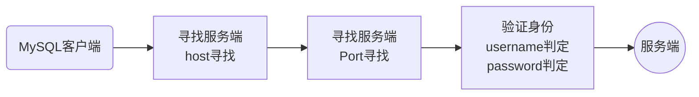

# 一、数据库基本介绍

> 目标：了解数据库的功能和常见数据库分类、数据库产品

* 数据库基本知识
* 数据库分类
* SQL简介
* MySQL访问

## 1、数据库基本知识

> 目标：了解数据库的概念和数据库的作用

> 概念

**数据库**：database（DB），是一种存储数据的仓库

* 数据库是根据数据结构组织、存储和管理数据
* 数据库能够长期、高效的管理和存储数据
* 数据库的目的就是能够存储（写）和提供（读）数据

## 2、数据库分类

> 目标：了解数据库的分类模式，以及分类的依据

> 概念

**数据库分类**：根据数据库的架构和数据组织原理进行分类

1、早期根据数据库的组织数据的存储模型分类

* 层次数据库：基于层次的数据结构（数据分层）
* 网状数据库：基于网状的数据结构（数据网络）
* 关系数据库：基于关系模型的数据结构（二维表）

2、现在较多根据实际数据管理模型分类（存储介质）

* 关系型数据库：基于关系模型的数据结构（二维表）通常存储在**磁盘**
* 非关系型数据库：没有具体模型的数据结构（键值对）通常存储在__内存__

## 3、关系型数据库

> 目标：了解关系型数据库的模型逻辑，了解当前流行的关系型数据库产品

> 概念

**关系型数据库**：是一种建立在关系模型上的数据库

* 关系模型
  * 关系数据结构（存储）
  * 关系操作集合（操作）
  * 关系完整性约束（约束）
* 关系型数据库存储在磁盘中（永久性存储）
* 关系型数据库系统（DBS）模型有四层结构
  * 数据库管理系统（DBMS）：管理系统运行（DataBase Management System）
  * 数据库（DB）：数据存储的管理者（小管理，受DBMS管理）
  * 数据表（Table）：数据关系管理者
  * 数据字段（Field）：依赖于数据表，实际数据存储者
* 关系型数据库产品
  * 大型：Oracle、DB2
  * 中型：MySQL、SqlServer
  * 小型：Sybase、Access

## 4、非关系型数据库

> 目标：了解非关系型数据库的概念和一些主流产品

> 概念

**非关系型数据库**：NoSQL（Not only SQL），不仅仅是关系型数据库

* 所有不是关系型数据库的统称
* 数据存储模型不是二维表，而是键值对（key->value）
* 存储的位置通常是内存（效率高）
* 不能永久性存储（需要定时存到关系型数据库中）
* 常见的非关系型数据库产品
  * MongoDB
  * Redis
  * Memcached

> 对比

NoSQL通常是与关系型数据库配合使用的，他们彼此是一种互补关系

* NoSQL运行在内存，解决效率问题
  * I/O问题
  * 效率问题
* MySQL运行在磁盘，解决稳定问题
  * 安全问题（永久存储）
  * 稳定

> 小结

1、NoSQL是对非关系型数据库的一类统称

* NoSQL是不仅仅只是关系型数据库的意思

2、NoSQL通常运行在内存

* 读取效率高
* 并发访问高
* 稳定性不高（断电即丢失）

3、NoSQL通常是键值对存储数据，访问也比较简单

## 5、SQL基本介绍

> 目标：了解SQL的作用和SQL的基本分类

> 概念

**SQL**： Structured Query Language，结构化查询语言，是一种针对关系型数据库特殊标准化的编程语言

* SQL是一种编程语言

* 能够实现用户数据库查询和程序设计
* SQL根据操作不同，分为几类
  * DQL： Data Query Language，数据查询语言，用于查询和检索数据
  * DML： Data Manipulation Language，数据操作语言，用于数据的写操作（增删改） 
  * DDL： Data Definition Language，数据定义语言，用于创建数据结构
  * DCL： Data Control Language，数据控制语言，用于用户权限管理
  * TPL： Transaction Process Language，事务处理语言，辅助DML进行事务操作（因此也归属于DML）   

> 小结

1、SQL虽然是编程语言，但是目前数据库通常只用来进行数据管理（逻辑部分给其他编程语言）

2、SQL虽然是针对关系型数据库的通用语言，但是不同的产品操作指令不完全通用

## 6、MySQL基本介绍

> 目标：了解MySQL产品的软件结构和访问原理

> 概念

**MySQL**：是瑞典AB公司下的一款**关系型数据库**

* MySQL当前属于甲骨文公司（AB->Sun->Oracle）
* MySQL开源免费（部分存储引擎）
* MySQL是一种C/S结构软件，因此需要MySQL的客户端来访问服务端（数据管理）
  * mysqld.exe：服务端
  * mysql.exe：客户端
* MySQL使用SQL指令对数据库进行操作

> 访问原理

> 小结

1、MySQL是一款流行的关系型数据库

2、MySQL是一款C/S结构的软件，需要客户端访问服务端

3、MySQL是基于SQL指令进行管理操作

## 7、MySQL访问

> 目标：掌握MySQL客户端访问服务端的基本操作，了解MySQL退出意义和操作

> 概念

**MySQL访问**：就是客户端连接上服务端，然后实现数据操作的过程

* 客户端访问服务端
  * 利用Windows控制台访问（MySQL客户端）
  * 利用数据库管理工具（Navicat）

* 客户端需要连接认证
  * -h：主机地址（本机localhost可以省略）
  * -P：端口号（默认3306可以省略）
  * -u：用户名
  * -p：用户密码

* 客户端连接上服务端就表示占用了一个资源，可以进行对应权限的操作

  * MySQL数据库连接资源有限：单个服务器最多16384个
  * 连接资源不够了其他访问就需要排队等待
  * 用完尽可能释放资源

* 客户端退出服务端

  * \q
  * quit
  * exit

  

> 步骤

1、打开客户端（CMD控制台）：mysql.exe

2、输入服务器信息（连接）和用户信息（验证）

3、执行SQL操作

4、断开连接

   

> 示例

1、控制台明文密码连接认证

2、控制台密文密码连接认证（安全）

> 小结

1、MySQL需要通过客户端来进行服务端访问

* 自带客户端mysql.exe：Windows下借助CMD
* 数据库管理工具：Navicat，图形化管理
* 支持MySQL扩展的编程语言：PHP、Java等

2、数据库操作需要进行连接认证

* 主机地址：-h，默认localhost可省略
* 端口：-P（大写字母），默认3306可省略
* 用户名：-u
* 密码：-p（小写字母）

3、数据库连接资源有限，用完即关闭

## 8、总结

1、数据库的作用要清楚：高效的存储和管理数据，为编程语言提供数据支撑

2、当前市面上数据库的分类主要为两类

* 关系型数据库：注重结构和数据存储的持久性
* 非关系型数据库：注重数据读取的效率

3、关系型数据库是几乎所有网站都会使用到的，必须掌握其概念

4、所有关系型数据库都是基于SQL进行数据的操作，MySQL数据库也是（不同的数据库产品对应的SQL指令可能有细微差别）

5、MySQL是一种C/S结构的软件，所以访问者必须通过客户端进行访问

* 客户端与服务端通常不会在一台电脑上
* 客户端访问服务端需要寻址、授权（-hPup）
* MySQL服务端的连接数是有限的，时刻注意用完就销毁（减少资源无效占用）