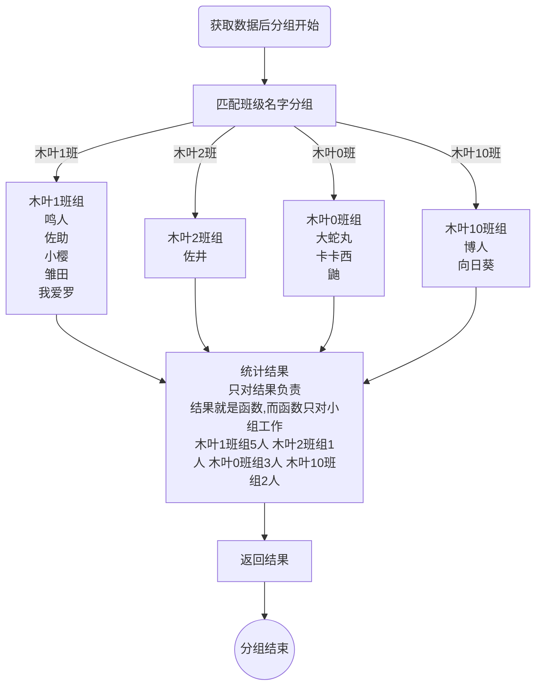
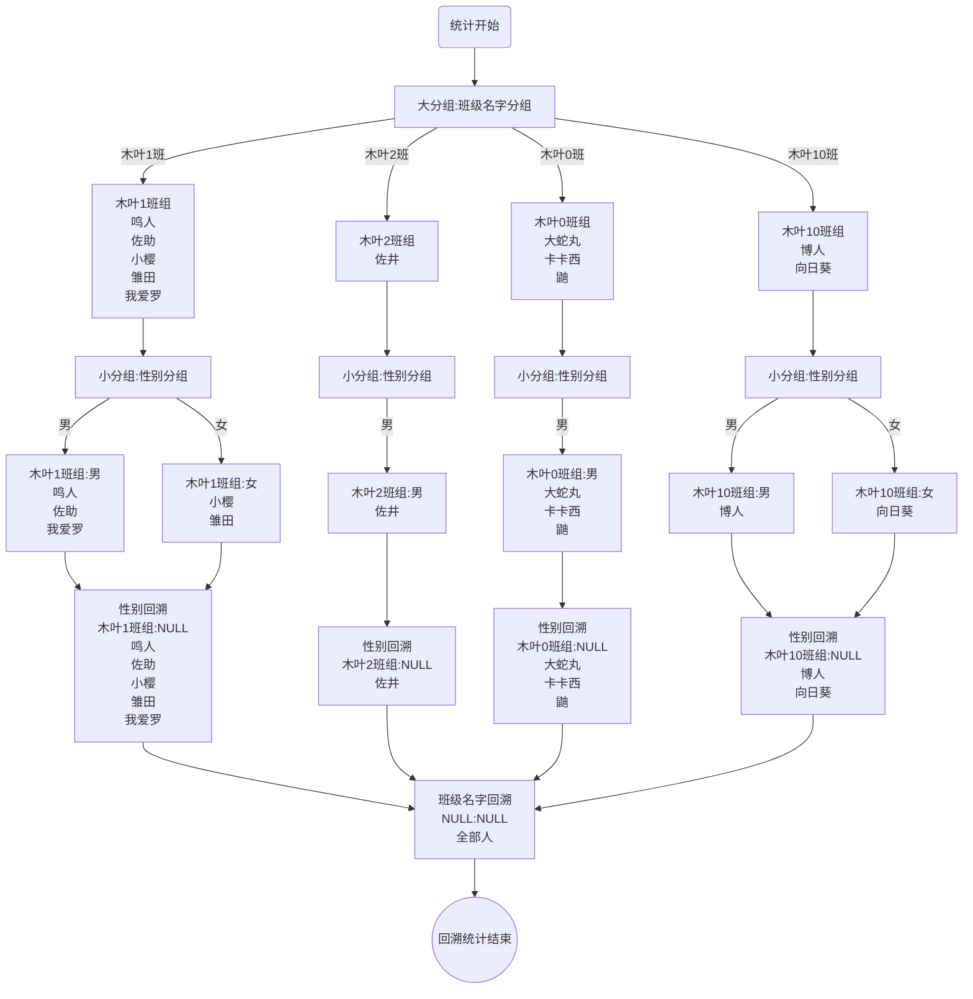

# MySQL高级SQL操作

> 学习目标：掌握常见的SQL高级操作，主要集中在数据操作（增删改查），基于基础操作之上实现一些复杂业务的数据操作

* 数据新增
  * 多数据插入
  * 蠕虫复制
  * 主键冲突
* 查询数据
  * 查询选项
  * 别名
  * 数据源
  * where子句
  * group by子句
  * having子句
  * order by子句
  * limit子句
* 更新数据
  * 限制更新
* 删除数据
  * 限制删除
  * 数据清除


> 概念

**高级SQL操作**：利用SQL指令的变化实现一些复杂业务的数据操作


> 示例

1、统计不同班级的人数信息

* 按照现有SQL操作，即便数据表已经存在数据，但是我们也无法通过SQL实现，只能取出来后通过其他代码对数据进行加工实现

* 通过高级SQL学习，我们就可以通过一条SQL指令完成操作

```mysql
select count(*),班级ID from 学生表 group by 班级ID;
```


> 小结

1、高级SQL操作能够帮助我们解决复杂的需求问题

2、在实际开发过程中，高级SQL操作占据的比例相当高


## 一、数据新增

> 学习目标：了解新增数据中一些高级的操作技巧，提升数据插入的效率问题、安全问题

* 批量插入
* 蠕虫复制
* 主键冲突
  * 冲突更新
  * 冲突替换


### 1、批量插入

> 目标：了解批量插入的语法，掌握批量插入的应用


> 概念

**批量插入**：是一种优化数据逐条插入的方式

* 批量插入数据的语法与简单数据插入的语法差不多

* 批量插入分为两种

  * 全字段批量插入

  ```mysql
  insert into 表名 values(值列表1),(值列表2),...(值列表N);
  ```

  * 部分字段批量插入（注意字段默认值）

  ```mysql
  insert into 表名 (字段列表) values (值列表1),(值列表2),...(值列表N);
  ```

  

> 步骤

1、用户的操作涉及到多记录同时插入（通常数据批量导入）

2、组装成批量插入SQL指令

* 字段为全字段（逻辑主键不存在没问题）：全字段批量插入SQL
* 部分字段：组织字段列表并检查其他字段是否允许默认值

3、执行批量插入


> 示例

1、批量插入学生成绩（t_30全字段）

```mysql
insert into t_30 values(null,'Tom','Computer',90),
(null,'Lily','Computer',92);
```


2、批量插入学生考试信息（t_30不包含成绩）

```mysql
insert into t_30 (stu_name,course) values('Tony','English'),('Ray','Math');
```


> 小结

1、批量插入可以针对性解决数据的批量导入之类的业务

2、批量插入可以一次性解决多条数据插入，能够有效降低客户端占用问题，提升数据操作效率

* MySQL8以后默认有事务安全，即批量要么都成功要么都失败，不会出现部分问题


### 2、蠕虫复制

> 目标：了解蠕虫复制的语法和原理，能够利用蠕虫复制实现数据的快速增长


> 概念

**蠕虫复制**：从已有表中复制数据直接插入到另外一张表（同一张表）

* 蠕虫复制的目标是**快速增加表中的数据**
  * 实现表中数据复制（用于数据备份或者迁移）
  * 实现数据的指数级递增（多用于测试）
* 蠕虫复制语法

```mysql
insert into 表名 [(字段列表)] select 字段列表 from 表名;
```

* 注意事项
  * 字段列表必须对应上
  * 字段类型必须匹配上
  * 数据冲突需要事先考虑


> 步骤

1、确定一张需要插入数据的表（一般与要蠕虫复制数据的表结构一致）

2、确定数据的来源表

* 字段数量匹配
* 字段类型匹配
* 所选字段不存在冲突（数据可能是重复数据）

3、使用蠕虫复制


> 示例

1、创建一张新表，将t_30表中的数据迁移到新表中

```mysql
create table t_35(
	id int primary key auto_increment,
    stu_name varchar(20) not null,
    course varchar(20) not null,
    score decimal(5,2)
)charset utf8;

insert into t_35 select * from t_30;
```


2、快速让t_35表中的数据达到超过100条（重复执行）

```mysql
insert into t_35 (stu_name,course,score) select stu_name,course,score from t_35;
```


> 小结

1、蠕虫复制的目标就是批量利用已有数据来丰富表数据

* 数据迁移：一次性复制表数据
* 数据增长：重复执行自我复制增长（数据测试使用）


### 3、主键冲突

> 目标：了解主键冲突的原理，掌握主键冲突的解决方案


> 概念

**主键冲突**：在数据进行插入时包含主键指定，而主键在数据表已经存在

* 主键冲突的业务通常是发生在业务主键上（业务主键本身有业务意义）

* 主键冲突的解决方案

  * 忽略冲突：保留原始记录

  ```mysql
  insert ignore into 表名 [(字段列表)] values(值列表);
  ```

  * 冲突更新：冲突后部分字段变成更新

  ```mysql
  insert into 表名 [(字段列表)] values(值列表) on duplicate key update 字段 = 新值[,字段=新值...];
  # 1、尝试新增
  # 2、更新
  ```
  * 冲突替换：先删除原有记录，后新增记录
  
  ```mysql
  replace into 表名 [(字段列表)] values(值列表); # 效率没有insert高（需要检查是否冲突）
  ```
  
  


> 步骤

1、确定当前业务可能存在主键冲突

2、选择主键冲突的解决方案


> 示例

1、用户名作为主键的用户注册（冲突不能覆盖）：username，password，regtime

```mysql
create table t_36(
	username varchar(50) primary key,
    password char(32) not null,
    regtime int unsigned not null
)charset utf8;

insert into t_36 values('username','password',12345678);
# 冲突忽略
insert ignore into t_36 values('username','12345678',12345678);
```


2、用户名作为主键的记录用户使用信息（不存在新增、存在则更新时间）：username，logintime

```mysql
create table t_37(
	username varchar(50) primary key,
    logintime int unsigned
)charset utf8;

insert into t_37 values('username',12345678);	# 当前时间戳

# 冲突更新（替换部分字段数据）
insert into t_37 values('username',12345678) on duplicate key update logintime = unix_timestamp();	# 当前时间戳
```

* 如果主键不冲突：新增
* 如果主键冲突：更新指定字段
* 上述方式适用于字段较多，但是可能冲突时数据变化的字段较少


3、用户名作为主键的记录用户使用信息（不存在新增、存在则更新全部）：username，logintime、clientinfo

```mysql
create table t_38(
	username varchar(50) primary key,
    logintime int unsigned,
    clientinfo varchar(255) not null
)charset utf8;

insert into t_38 values('username',unix_timestamp(),'{PC:chrome}');

# 替换插入
replace into t_38 values('username',unix_timestamp(),'{phone:uc}');
```

* replace遇到主键重复就会先删除、后新增
* 如果有较多字段需要更新：建议使用替换


> 小结

1、主键冲突的解决方案有三种，但是需要根据具体的业务来选择合适的方式

* 忽略新数据：`insert ignore`
* 更新部分数据：`insert ... on duplicate key update`
* 全部替换：`replace into`

2、从效率上来讲，`insert into`不考虑冲突的效率最高，三种解决冲突的方式都会有效率下降（需要检索），其中三种本身的效率依次是：忽略新数据 > 更新部分数据 > 替换全部


## 二、数据查询

> 学习目标：了解SQL查询操作的复杂性和细致性，从各个维度掌握查询的要点，利用各种维度来实现复杂业务的解析要求

* 查询选项
* 别名应用
  * 字段别名
  * 表别名
* 数据源
  * 单表数据源
  * 多表数据源
  * 子查询数据源
* where子句
  * 比较运算
  * 逻辑运算
  * 空运算
* group by子句
  * 聚合函数
  * 回溯统计
* having子句
* order by子句
* limit子句
  * 分页制作


> 小结

1、数量掌握高级数据查询后，以前需要多次操作的业务基本都可以通过一些复杂SQL的编写实现一次性进行数据筛选提炼，从而达到一次性解决问题的要求


### 1、查询选项

> 目标：了解查询选项的概念，理解查询选项所带来的价值和应用场景


> 概念

**查询选项**：用于对查询结果进行**简单数据筛选**

* 查询选项是在select关键字之后，有两个互斥值
  * all：默认，表示保留所有记录
  * distinct：去重，重复的记录（所有字段都重复）


> 步骤

1、查询的结果需要去除重复记录

2、使用distinct查询选项去重（默认就是all保留全部）


> 示例

查看商品表中所有品类的商品信息：重复的商品只保留一次（名字、价格、属性都一致）

```mysql
create table t_39(
	id int primary key auto_increment,
    goods_name varchar(50) not null,
    goods_price decimal(10,2) default 0.00,
    goods_color varchar(20),
    goods_weight int unsigned comment '重量，单位克'
)charset utf8;

insert into t_39 values(null,'mate10',5499.00,'blue',320),
(null,'mate10',5499.00,'gray',320),
(null,'nokia3301',1299,'black',420);

# 考虑所有字段的去重（不含逻辑主键）
select distinct goods_name,goods_price,goods_color,goods_weight from t_39;
select goods_name,goods_price,goods_color,goods_weight from t_39; # 保留所有

# 不考虑颜色去重
select distinct goods_name,goods_price,goods_weight from t_39;
select all goods_name,goods_price,goods_weight from t_39;
```


> 小结

1、select选项主要是用来进行数据全保留或者去重选择的

* all：默认，保留全部（关键字可以没有）
* distinct：手动选择，去重（针对所选字段构成的记录，而不是某个字段）

2、distinct选项一般用于制作数据报表时使用


### 2、字段选择&别名

> 目标：了解字段别名的作用，正确使用字段选择


> 概念

**字段选择**：根据实际需求选择的要获取数据的字段信息

* 根据实际需求，明确所需要的字段名字，使用英文逗号`,`分隔
* 获取所有字段，使用星号`*`通配所有字段
* 字段数据可以不一定是来自数据源（select只要有结果即可）
  * 数据常量：`select 1`
  * 函数或者变量：`select unix_timestamp(),@@version` （@@是系统变量的前缀，后面跟变量名）

**字段别名**：给字段取的临时名字

* 字段别名使用as语法实现
  * 字段名 as 别名
  * 字段名 别名
* 字段别名的目的通常为了保护数据
  * 字段冲突：多张表同时操作有同名字段（系统默认覆盖），想保留全部
  * 数据安全：对外提供数据不使用真实字段名字


> 步骤

1、明确需要查询的字段信息

* 全部：`*`
* 部分：确定字段列表

2、确定存在数据冲突或者需要数据保护（通常可以理解为对外提供给别的系统访问）

* 使用别名


> 示例

1、查询商品信息

```mysql
# 全部查询
select * from t_39;

# 需求为商品名字和价格
select goods_name,goods_price from t_39;

# 别名使用
select goods_name as gn,goods_price gp from t_39;
```


2、不需要数据源的数据获取：select的表达式本身能算出结果）

```mysql
# 获取当前时间戳和版本号
select unix_timestamp() as now,@@version as version,@@version;
```


> 小结

1、字段的选择只要在保证数据需求能实现的情况下，尽可能少使用`*`代替（MySQL优化）

* 减少服务器的数据读取压力
* 减少网络传输压力
* 让客户端能够精确解析数据（不用大海捞针）

2、字段别名的灵活使用一方面可以保证原始数据的安全，也可以为数据使用者提供便利

* 同名字段覆盖问题（连表操作学习时会遇到）
* 原始字段保护
* 数据字段的简化

3、select是SQL中用于取出数据的一种指令，这种指令未必一定需要从数据表取出数据，只要是本身能够有数据的表达式，都可以使用select获取


### 3、数据源

> 目标：了解数据源的作用和特性，以及数据源所带来的效果


> 概念

**数据源**：from关键字之后，数据的来源。只要最终结果是一个二维表，都可以当做数据源

* 单表数据源：数据源就是一张表  `from 表名`
* 多表数据源：数据来源是多张表（逗号分隔） `from  表名1,表名2,...表名N`
* 子查询数据源：数据来源是一个查询结果 `from (select 字段列表 from 表名) as 别名`
  * 数据源要求必须是一个`表`
  * 如果是查询结果必须给起一个表别名
* 数据表也可以指定别名
  * 表名 as 别名
  * 表名 别名


> 示例

1、单表数据源：最简单的数据源，直接从一个数据表获取

```mysql
select * from t_27;
```


2、多表数据源：利用一张表的一条数据匹配另外一张表的所有记录，记录结果为：记录数 = 表1记录数 * 表2记录数；字段数 = 表1字段数 + 表2字段数（笛卡尔积）

```mysql
select * from t_27,t_30;
```


3、子查询数据源：数据来源是一个select对应的查询结果

* 查询语句需要使用括号包裹
* 查询结果需要指定别名

```mysql
select * from (select * from t_27,t_30) t; # 数据有冲突查不出来
select * from (select * from t_27) as t;
```


4、如果有时候名字较长或者使用不方便，可以利用表别名

```mysql
select * from t_30 as t;

select t1.*,t2.stu_name from t_27 as t1,t_30 t2;
```

* 一般情况下别名设置是为了后续条件中可以直接使用别名
* 如果多表操作下，可以使用表别名来明确提取表字段


> 小结

1、数据源是为查询、检索提供数据支持的，使用时需要明确指定

2、通常情况下数据源不会使用简单的多表数据源（笛卡尔积）

3、数据表的别名在负责SQL查询操作时非常有用，而且有些地方是必须使用（如子查询数据源）


### 4、where子句

> 目标：了解where的作用，掌握where中常见的数据筛选手段，懂得利用where来进行数据有效性筛选


> 概念

**where子句**：跟在from数据源之后，对数据进行条件匹配

* where是在磁盘读取后，进入内存之前进行筛选
  * 不符合条件的数据不会进入内存
* where筛选的内容因为还没进入内存，所以数据是没有被加工过的
  * 字段别名不能在where中使用


> 步骤

1、确定要查询的数据需要进行条件筛选

2、使用where进行数据筛选


> 示例

1、查询t_35表中学生为lily的成绩信息

```mysql
select * from t_35 where stu_name = 'Lily';
```


2、因为where是在磁盘取数据时进行条件筛选，此时数据没有进入内存，所以字段别名是无效的

```mysql
# 错误
select stu_name name,score from t_35 where name = 'Lily';
```


> 小结

1、where是用来匹配条件筛选数据的

2、where是在数据从磁盘取出，还没进入内存前进行筛选：筛选过后合适的才会进入到内存（后续才能显示）

3、成熟的项目中几乎每次执行查询都是会使用条件查询的


### 5、运算符

> 目标：了解MySQL中一些常用的运算符，掌握运算符的使用方式和执行效果


> 概念

**运算符**：用于进行运算的符号

* 比较运算符
  * \>（大于）、\<（小于）、=（等于）、\>\=（大于等于）、\<\=（小于等于）、\<\>（不等于）
  * between  A  and  B：A和B之间（A小于B），包括A和B本身（数值比较）
  * in (数据1,数据2,...数据N)：在列举的数据之中
  * like 'pattern'：像上面样的，用于字符串比较
    * \_：单下划线，匹配对应位置的一个任意字符（ab_：ab开头+一个字符，匹配abc，ab1，但不能匹配abcd）
    * %：匹配当前位置（往后）任意数量任意字符（ab%：ab开头+任意数量任意字符，匹配abc，ab1，abcd）
* 逻辑运算符
  * and（逻辑与）、or（逻辑或）、not（逻辑非）
* null运算符
  * is null（为空）、is not null（不为空）


> 步骤

1、确定需要使用运算符进行运算

2、根据数据要求使用准确的运算符


> 示例

1、查询成绩不及格的所有学生信息

```mysql
# 成绩条件：成绩是数值，又是比大小，可以直接使用比较运算符
select * from t_35 where score < 60;
```


2、查询成绩在60-90间的学生信息

```mysql
# 成绩条件：区间60到90，可以有两种解决方案

select * from t_35 where score between 60 and 90;
select * from t_35 where score >= 60 and score <= 90;
```


3、查询还没有成绩的学生

```mysql
# 成绩条件：成绩为null，所以不能用比较符号查，只能使用is null实现
select * from t_35 where score is null;
```


> 小结

1、运算符可以用来进行字段数据运算，配合where进行条件筛选

2、基本运算符与其他编程语言都差不多，SQL中有几个特殊的要了解一下

* between and：一种\>= and \<=的便捷写法
* in：用来做具体选择，类似于switch里的case
* is null/is not null：字段值为Null的判定方式

3、熟练应用的前提是不断熟练的使用，掌握每个运算符带来的结果和效果


### 6、group by子句

> 目标：了解分组的概念和原理，掌握分组统计的应用


> 概念

**group by子句**：分组统计，根据某个字段将所有的**结果分类**，并进行**数据统计分析**

* 分组的目的不是为了显示数据，一定是为了统计数据
* group by子句一定是出现在where子句之后（如果同时存在）
* 分组统计可以进行统计细分：先分大组，然后大组分小组
* 分组统计需要使用统计函数
  * group_concat()：将组里的某个字段全部保留
  * any_value()：不属于分组字段的任意一个组里的值
  * count()：求对应分组的记录数量
    * count(字段名)：统计某个字段值的数量（NULL不统计）
    * count(*)：统计整个记录的数量（较多）
  * sum()：求对应分组中某个字段是和
  * max()/min()：求对应分组中某个字段的最大/最小值
  * avg()：求对应分组中某个字段的平均值


> 步骤

1、确定要进行数据统计

2、确定统计对象：分组字段（可以多个）

3、确定要统计的数据形式：选择对应统计函数

4、分组统计


> 示例

1、创建一张表，存储学生信息

```mysql
create table t_40(
id int primary key auto_increment,
name varchar(10) not null,
gender enum('男','女','保密'),
age tinyint unsigned not null,
class_name varchar(10) not null comment '班级名称'
)charset utf8;

insert into t_40 values(null,'鸣人','男',18,'木叶1班'),
(null,'佐助','男',18,'木叶1班'),
(null,'佐井','男',19,'木叶2班'),
(null,'大蛇丸','男',28,'木叶0班'),
(null,'卡卡西','男',29,'木叶0班'),
(null,'小樱','女',18,'木叶1班'),
(null,'雏田','女',18,'木叶1班'),
(null,'我爱罗','男',19,'木叶1班'),
(null,'向日葵','女',6,'木叶10班'),
(null,'博人','男',8,'木叶10班'),
(null,'鼬','男',28,'木叶0班');
```


2、统计每个班的人数

```mysql
select count(*),class_name from t_40 group by class_name;
```


3、多分组：统计每个班的男女学生数量

```mysql
select count(*),class_name,gender from t_40 group by class_name,gender;
```


4、统计每个班里的人数，并记录班级学生的名字

```mysql
select count(*),group_concat(name),class_name from t_40 group by class_name;
select count(*),any_value(name),class_name from t_40 group by class_name;
```


> 分组原理

以统计班级学生为例




> 小结

1、分组与统计是不分离的，分组必然要用到统计，而统计一旦使用实际上就进行了分组

2、分组统计使用数据数据的查询只能依赖统计函数和被分组字段，而不能是其他字段（MySQL7以前可以，不过数据没意义：因为系统只保留组里的第一个）

3、group by子句有自己明确的位置：在where之后（where可以没有）


### 7、回溯统计

> 目标：了解回溯统计的意义和原理


> 概念

**回溯统计**：在进行分组时（通常是多分组），每一次结果的回溯都进行一次汇总统计

* 回溯统计语法：在统计之后使用 `with rollup`


> 步骤

1、确定要进行分组统计

2、确定是多分组统计

3、需要对每次分组结果进行汇总

4、使用回溯统计


> 示例

统计每个班的男女同学数量，同时要知道班级人数总数

```mysql
# 只统计每个班的男女同学数量，没有班级汇总
select count(*),class_name,gender,group_concat(name) from t_40 group by class_name,gender;

# 汇总统计：回溯
select count(*),class_name,gender,group_concat(name) from t_40 group by class_name,gender with rollup;
```


> 回溯统计原理





> 小结+

1、回溯统计一般用在多字段分组中，用来统计各级分组的汇总数据

2、因为回溯统计会将对应的分组字段置空（不置空无法合并），所以回溯的数据还需要经过其他程序语言加工处理才能取出数据来


### 8、分组排序

> 目标：了解分组排序概念，能够运用分组排序解决实际问题


> 概念

**分组排序**：在分组后统计结果时可以根据分组字段进行升序或者降序显示数据

* 默认的系统就会自动对分组结果根据分组字段进行升序排序
* 可以设定分组结果的排序方式
  * group by 字段名 [ASC]：升序排序（默认）
  * group by 字段名 DESC：降序排序


> 步骤

1、确定使用分组统计

2、需要对结果进行降序排序（升序不用管）

3、使用分组降序排序


> 示例

对分组结果女性优先显示：gender为枚举，男值为1，女值为2

```mysql
select count(*),class_name,gender,group_concat(name),any_value(name) from t_40 group by class_name,gender desc;
```


> 小结

1、分组排序是针对分组的结果，通过分组字段进行排序

2、一般情况下较少使用分组排序


### 9、having子句

> 目标：了解having子句的作用，掌握having子句的实际运用场景


> 概念

**having子句**：类似于where子句，是用来进行条件筛选数据的

* having子句本身是针对**分组统计结果进行条件筛选**的

* having子句必须出现在group by子句之后（如果同时存在）
* having针对的数据是在内存里已经加载的数据
* having几乎能做where能做的所有事，但是where却不一定
  * 字段别名（where针对磁盘数据，那时还没有）
  * 统计结果（where在group by之前）
  * 分组统计函数（having通常是针对group by存在的）


> 步骤

1、前面有分组统计

2、需要针对分组统计后的结果进行数据筛选

3、使用having组织条件进行筛选


> 示例

1、获取班级人数小于3的班级

```mysql
select count(*) as `count`,class_name,group_concat(name) from t_40 group by class_name having `count` < 3;

select count(*) as `count`,class_name,group_concat(name) from t_40 group by class_name having count(*) < 3; # 多用了一次函数（效率降低）

select class_name,group_concat(name) from t_40 group by class_name having count(*) < 3; # 没办法，前面没统计，只能自己统计
```


> 小结

1、having也是用于数据筛选的，但是本质是针对分组统计，如果没有分组统计，不要使用having进行数据筛选

2、能用where解决问题的地方绝不使用having

* where针对磁盘读取数据，源头解决问题
* where能够限制无效数据进入内存，内存利用率较高，而having是针对内存数据筛选


### 10、order by子句

> 目标：了解排序的概念和原理，掌握排序的实际应用场景


> 概念

**order by子句**：排序，根据某个指定的字段进行升序或者降序排序

* 排序的参照物是校对集
* order by子句在having子句字后（如果同时存在）
* 排序分为升序和降序：默认是升序
  * order by 字段 [ASC]：升序
  * order by 字段 DESC：降序
* 多字段排序：在根据某个字段排序好后，可以再细分排序


> 步骤

1、确定需要排序的字段

2、确定排序的方式：升序 or 降序

3、使用排序


> 示例

1、单字段排序：给所有学生按照年纪大小升序排序

```mysql
select * from t_40 order by age;
select * from t_40 order by age asc;
```


2、多字段排序：先性别降序排序，然后按年龄升序排序

```mysql
select * from t_40 order by gender desc,age;
select * from t_40 order by gender desc,age asc;
```


> 小结

1、排序是针对前面所得到的结果进行排序（已经进入到内存的数据）

2、多字段排序是在第一个字段排好序的情况下，不改变原来排序的基调后，再小范围排序（类似分组）

3、实际开发中排序的使用非常常见，尤其是在数值、时间上多见


### 11、limit子句

> 目标：了解limit子句的原理，掌握limit的使用规范和应用场景


> 概念

**limit子句**：限制数据的获取数量（记录数）

* limit子句必须在order by子句之后（如果同时存在）
* limit限制数量的方式有两种
  * limit 数量：限制获取的数量（不保证一定能获取到指定数量）
  * limit 起始位置,数量：限制数据获取的位置以及数量（分页）


> 步骤

1、确定要对记录数进行限制

2、确定限制的方式：限定数量 or 限定位置+限定数量


> 示例

1、获取t_40表中前3条数据

```mysql
select * from t_40 limit 3;
```


2、获取t_40表中第3条以后的3条数据

```mysql
select * from t_40 limit 3,3;
select * from t_40 limit 6,3;
```


> 小结

1、limit限制数量可以有效的减少服务器的压力和传输压力

2、常利用limit来实现分页获取数据


### 12、总结


1、查询操作是所有操作里使用的最多也是最终的操作

2、查询操作的完整语法

```mysql
select select选项 字段列表[别名]|* from 数据源[别名] where子句 group by子句 having子句 order by子句 limit 子句;
```

* 各个位置的顺序不能调换
* 五子句（where、group by、having、order by、limit）可以没有，但是出现后一定要保证顺序
* group by到最后都是针对已经加载带内存中的数据进行加工处理

3、很多结构的组合其实可以达到同一效果，但是可能过程和效率会不同


## 三、数据更新

> 目标：了解限制更新的概念，理解限制更新的原理


> 概念

**限制更新**：即更新时对更新的记录数进行限制

* 限制更新通过limit来实现
* 限制更新其实是局部更新的一种手段，一般更多情况下是依据条件精确更新


> 步骤

1、确定要进行批量更新：符合条件的部分

2、确定更新的数量

3、使用limit限制更新数量


> 示例

对会员选3个发送10元红包（添加到账户）

```mysql
create table t_41(
	id int primary key auto_increment,
    username varchar(50) not null unique,
    password char(32) not null,
    account decimal(10,2) default 0.00
)charset utf8;

insert into t_41 values(null,'username1','password',default),
(null,'username2','password',default),
(null,'username3','password',default),(null,'username4','password',default),(null,'username5','password',default);


update t_41 set account = account + 10 limit 3;
```


> 小结

1、限制更新可以实现批量小范围操作

2、实际开发当中，极少出现这类操作，一般都愿意精准操作（利用where条件明确更新条件）

3、更新操作不可逆


## 四、数据删除

> 学习目标：了解数据删除的其他规则，理解数据删除的危害

* 限制删除
* 清空数据


### 1、限制删除

> 目标：了解限制删除的操作


> 概念

**限制删除**：限制要删除的记录数

* 使用limit限制删除数量
* 一般很少使用限制删除，通常是通过where条件精确删除


> 步骤

1、确定要进行数据批量删除

2、确定通过where条件限定后无法完全满足删除条件

3、使用limit限制删除数量完成目标


> 示例

删除没有账户余额的一个用户（当前用户量少，一般数量会大些）

```mysql
delete from t_41 where account = 0 limit 1;
```


> 小结

1、限制删除本质也是删除，操作不可逆，谨慎使用

2、更愿意使用精确删除


### 2、清空数据

> 目标：了解清空数据的语法，理解清空所带来的效果


> 概念

**清空数据**：将表中的所有数据清除，并且将表的所有状态回到原始状态

* 清空数据的本质是先删除表，后创建表
* 清空数据能够让表的一些变化状态回到原始状态
  * 自增长重新回到初始值
* 清空语法： `truncate 表名`


> 步骤

1、确定要删除表中所有数据

2、确定需要让表状态回到原始

3、truncate清空数据


> 示例

清空用户数据表

```mysql
truncate t_41;
```


> 小结

1、清空数据表是一种比delete更彻底的数据删除方式，所以使用之前必须要慎重

2、一般只会在开发阶段才会使用这种数据删除操作，如表数据发生错乱，或者业务发生变化