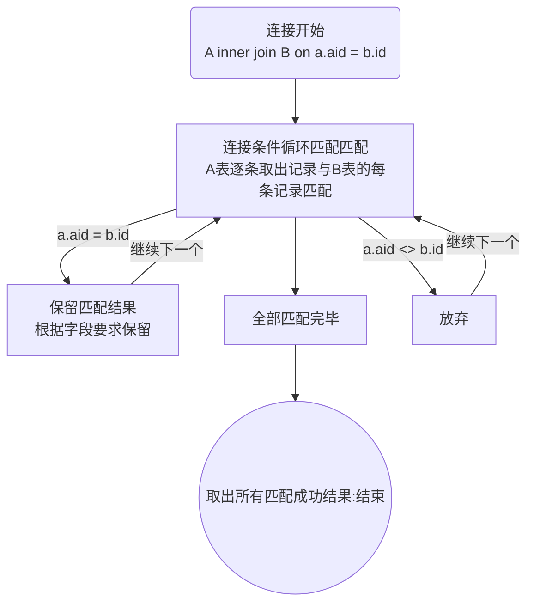

# MySQL多表操作

> 学习目标：了解实体之间的关联关系，掌握多表操作的方式和解决的需求问题

* 联合查询
* 连接查询
* 子查询


> 示例

不管是大型还是小型项目，一个数据库里都会有N张表，表之间也通过一对一、多对一或者多对多关系进行关联：如新闻管理系统

作者表：id、用户名、密码

新闻表：id、标题、内容、发布时间、作者id


显示新闻的时候是肯定需要显示作者姓名的

* 原始方式：查出新闻-->查出作者ID-->查出作者
  * 步骤多
  * 如果是批量显示新闻就更麻烦
* 多表操作：使用连接查询一条SQL搞定


> 小结

1、多表操作是实际开发时经常遇到的解决问题的方案

2、多表操作能够在数据库层就实现大量数据的组合或者筛选


## 一、联合查询

> 学习目标：了解联合查询的现实意义，掌握联合查询的实际运用

* 联合查询
* 联合查询排序


### 1、联合查询

> 目标：了解联合查询的语法，掌握联合查询的作用


> 概念

**联合查询**：union，是指将多个查询结果合并成一个结果显示

* 联合查询是针对查询结果的合并（多条select语句合并）
* 联合查询语法

```mysql
select 查询【决定字段名字】
	union 查询选项
select 查询
...
```

* 联合查询要求：联合查询是结果联合显示
  * 多个联合查询的字段结果数量一致
  * 联合查询的字段来源于第一个查询语句的字段
* 查询选项：与select选项雷士
  * all：保留所有记录
  * distinct：保留去重记录（默认）


> 步骤

1、确定要进行多个表数据的联合操作

* 表结构一致
* 数据汇总

2、确定数据的要求：全部保留 or 去重

3、使用联合查询


> 示例

1、创建一个表与t_40，并插入数据

```mysql
create table t_42 like t_40;

insert into t_42 values(null,'犬夜叉','男',200,'神妖1班'),
(null,'日暮戈薇','女',16,'现代1班'),
(null,'桔梗','女',88,'法师1班'),
(null,'弥勒','男',28,'法师2班'),
(null,'珊瑚','女',20,'法师2班'),
(null,'七宝','保密',5,'宠物1班'),
(null,'杀生丸','男',220,'神妖1班'),
(null,'铃','女',4,'现代1班'),
(null,'钢牙','男',68,'神妖1班'),
(null,'奈落','男',255,'神妖1班'),
(null,'神乐','女',15,'神妖2班');
```

* t_42与t_40结构一样，可以理解为因为数据量大拆分到了两个表中


2、使用联合查询将两张表的数据拼接到一起显示

```mysql
select * from t_40 
union
select * from t_42;
```


3、联合查询选项默认是distinct

```mysql
select * from t_40
union 
select * from t_40;

select * from t_40
union all
select * from t_40;
```


4、联合查询不要求字段类型一致，只对数量要求一致，而且字段与第一条查询语句相关

```mysql
select name from t_40
union all
select age from t_40;
```

* 注意：如果数据不能对应，那么查询没有意义


5、如果使用where对数据进行筛选，where针对的是select指令，而不是针对union结果

```mysql
select * from t_40 
union all
select * from t_42
where gender = '女';
```

* where只针对第二条select有效
* 若要全部有效，需要select都使用where


> 小结

1、union是负责将多次查询的结果统一拼凑显示

* 记录数增加
* 字段数不变（第一条SQL指令决定）

2、union常用方式

* 因为数据量大分表存储，然后统一查看或者统计
* 根据不同维度对数据进行筛选，然后统一查看或者统计

3、union默认是去重的，想要保留全部查询结果，需要使用union all


### 2、联合查询排序

> 目标：了解联合查询排序的概念，掌握联合查询排序的方法


> 概念

**联合查询排序**：针对联合查询的结果进行排序

* order by本身是对内存结果进行排序，union的优先级高于order by，所以order by默认是对union结果进行排序
* 如果想要对单独select的结果进行排序，需要两个步骤
  * 将需要排序的select指令进行括号包裹（括号里使用order by）
  * order by必须配合limit才能生效（limit一个足够大的数值即可）


> 步骤

1、确定需要对联合查询进行排序

2、确定排序内容

* 针对union结果排序
* 针对union前的select结果进行排序

3、选择合适的排序方式


> 示例

1、将t_40和t_42表的结果使用年龄降序排序

```mysql
select * from t_40
union all
select * from t_42
order by age desc; #针对的是整个union之后的结果
```


2、t_40表按年龄降序排序，t_42表按年龄升序排序

```mysql
# 无效方式
(select * from t_40 order by age desc)
union 
(select * from t_42 order by age);

# 正确方式
(select * from t_40 order by age desc limit 99999)
union 
(select * from t_42 order by age desc limit 99999);
```


> 小结

1、联合排序需要区分排序的内容是select结果还是union结果

* union结果：在最后使用排序即可
* select结构：需要针对select使用排序
  * select必须使用括号包裹
  * select里的排序必须配合limit才会生效


## 二、连接查询

> 学习目标：理解连接查询的概念，掌握重点连接方式的使用，运用连接查询解决表关系的问题

* 交叉连接

* 内连接
* 外连接
  * 左外连接
  * 右外连接
* 自然连接
* using关键字


> 概念

**连接查询**：join，将两张表依据某个条件进行数据拼接

* join左右各一张表：join关键字左边的表叫左表，右边的表叫右表
* 连接查询的结果都是记录会保留左右表的所有字段（字段拼接）
  * 具体字段数据依据查询需求确定
  * 表字段冲突需要使用表别名和字段别名区分
* 不同的连表有不同的连接方式，对于结果的处理也不尽相同
* 连接查询不限定表的数量，可以进行多表连接，只是表的连接需要一个一个的连（A join B join C ...）


> 小结

1、连接查询就是通过字段拼接，把两张表的记录变成一条记录：字段数量增加

2、连接查询的目的是将分散在不同表的数据组合到一起，方便外部使用数据


### 1、交叉连接

> 目标：了解交叉连接产生的概念，认识交叉连接的效果


> 概念

**交叉连接**：cross join，不需要连接条件的连接

* 交叉连接产生的结果就是笛卡尔积
  * 左表的每一条记录都会与右表的所有记录连接并保留
* 交叉连接没有实际数据价值，只是丰富了连接查询的完整性


> 示例

交叉连接t_41和t_42表

```mysql
select * from t_41 cross join t_42; # t_41,t_42
```


> 小结

1、笛卡尔积无意义，尽量避免出现


### 2、内连接

> 目标：理解内连接的概念和原理，掌握内连接的应用场景和解决方法


> 概念

**内连接**：[inner] join，将两张表根据指定的条件连接起来，严格连接

* 内连接是将一张表的每一条记录去另外一张表根据条件匹配
  * 匹配成功：保留连接的数据
  * 匹配失败：都不保留
* 内连接语法： `左表 join 右表 on 连接条件`


> 步骤

1、确定需要从多张表中获取数据组成记录

2、确定连接的要求是保留连接成功的，不成功的数据不要

3、使用内连接


> 示例

1、设计学生表和专业表：学生对专业多对一关系

```mysql
# 学生表
create table t_43(
	id int primary key auto_increment,
    name varchar(50) not null,
    course_no int
)charset utf8;
insert into t_43 values(null,'Student1',1),
(null,'Student2',1),
(null,'Student3',2),
(null,'Student4',3),
(null,'Student5',1),
(null,'Student6',default);

# 专业表
create table t_44(
	id int primary key auto_increment,
    name varchar(50) not null unique
)charset utf8;
insert into t_44 values(null,'Computer'),(null,'Software'),(null,'Network');
```


2、获取已经选择了专业的学生信息，包括所选专业

```mysql
# 学生和专业在两个表中，所以需要连表
# 学生必须有专业，而专业也必须存在，所以是内连接
# 连接条件：专业编号
# 两张表有两个字段冲突：id、name，所以需要使用别名
select t_43.*,t_44.name as course_name from t_43 inner join t_44 on t_43.course_no = t_44.id;

# 表名的使用也可以使用别名
select s.*,c.name as c_name from t_43 as s inner join t_44 c on s.course_no = c.id;
```

* 字段冲突的话在MySQL里倒是不影响，只是会同时存在，但是后续其他地方使用就不方便了


> 原理分析




> 小结

1、内连接匹配规则就是必须保证左表和右表同时存储连接关系，这样的数据才会保留

2、扩展：内连接可以没有on条件，那么得到的结果就是交叉连接（笛卡尔积），无意义

3、扩展：内连接的on关键字可以换成where，结果是一样（但是不建议使用）


### 3、外连接

> 目标：理解外连接的语法和原理，掌握外连接的需求和解决方案


> 概念

**外连接**：outer join，是一种不严格的连接方式

* 外连接分为两种
  * 左外连接（左连接）：left join
  * 右外连接（右连接）：right join
* 外连接有主表和从表之分
  * 左连接：左表为主表
  * 右连接：右表为主表
* 外连接是将主表的记录去匹配从表的记录
  * 匹配成功保留
  * 匹配失败（全表）：也保留，只是从表字段置空


> 步骤

1、确定进行连表操作

2、确定要有数据保护，即表中数据匹配失败也要保留

3、确定主从表

4、选择对应外连接


> 示例

1、查出所有的学生信息，包括所在班级（左连接）

```mysql
# 主要数据是学生，而且是全部学生：外连接、且学生表是主表
select s.*,c.name c_name from t_43 s left join t_44 c on s.course_no = c.id;
```


2、查出所有班级里的所有学生（右连接）

```mysql
# 主表是班级
select s.*,c.name c_name from t_43 s right join t_44 c on s.course_no = c.id;
```


> 小结

1、外连接与内连接的区别在于数据匹配失败的时候，外连接会保留一条记录

* 主表数据保留
* 从表数据置空

2、外连接不论是左连接还是右连接，字段的顺序不影响，都是先显示左表数据，后显示右表数据

3、外连接必须使用on作为连接条件（不能没有或者使用where替代）


### 4、自然连接

> 目标：了解自然了解的特性，知道自然连接的使用方式


> 概念

**自然连接**：natural join，是一种自动寻找连接条件的连接查询

* 自然连接不是一种特殊的连接方式，而是一种自动匹配条件的连接

* 自然连接包含自然内连接和自然外连接
  * 自然内连接：natural join
  * 自然外连接：natural left/right join
* 自然连接条件匹配模式：自动寻找相同字段名作为连接条件（字段名相同）


> 步骤

1、需要进行连表查询结果

2、连表查询的表字段能够直接关联（字段名字相同：非常高的表结构设计）

3、选择合适的连接方式：内连接 or 外连接

4、使用自然连接


> 示例

1、自然连接t_43和t_44表

```mysql
select  * from t_43 natural join t_44;
```


2、自然连接是不管字段是否有关系的，只管名字是否相同：如果想要自然连接成功，那么字段的设计就必须非常规范

```mysql
create table t_45(
	s_id int primary key auto_increment,
    s_name varchar(50) not null,
    c_id int comment '课程id'
)charset utf8;
insert into t_45 select * from t_43;

create table t_46(
    c_id int primary key auto_increment,
    c_name varchar(50) not null unique
)charset utf8;
insert into t_46 select * from t_44;

# 自然连接：条件只有一个相同的c_id
select * from t_45 natural join t_46;
```

* 自然连接会将同名条件合并成一个字段（数据一样）


> 小结

1、自然连接本身不是一种特别连接，是基于内连接、外连接和交叉连接实现自动条件匹配而已

* 没有条件（没有同名字段）：交叉连接
* 有条件：内连接/外连接（看关键字使用）

2、自然连接使用较少，因为一般情况下表的设计很难做到完全标准或者不会出现无关同名字段


### 5、using关键字

> 目标：了解using关键字的作用


> 概念

**using关键字**：连接查询时如果是同名字段作为连接条件，using可以代替on出现（比on更好）

* using是针对同名字段（using(id) === A.id = B.id）
* using关键字使用后会自动合并对应字段为一个
* using可以同时使用多个字段作为条件


> 步骤

1、需要进行连表进行数据查询

2、两个表的连接条件字段同名

3、使用using关键字作为连接条件


> 示例

查询t_45中所有的学生信息，包括所在班级名字

```mysql
select s.*,c.c_name from t_45 s left join t_46 c using(c_id);
select * from t_45 s left join t_46 c using(c_id);
```


> 小结

1、using关键字用来简化同名条件字段的连接条件行为

2、using关键字与自然连接相似，但是比自然连接灵活，可以指定有效的同名连接条件，忽略无效的同名字段


### 6、总结


1、连接查询是实际开发过程中应用最多的查询方式

* 很少出现单表查询操作
* 实体（表）间或多或少都是有关联的

2、连接查询的效率肯定没有单表查询高

* 逆规范化可以适当的运用来提升效率

3、连接查询中使用的较多的就是内连接和外连接


## 三、子查询

> 学习目标：了解子查询的应用场景，能够使用子查询解决相应的需求

* 子查询分类
* 标量子查询
* 列子查询
* 行子查询
* 表子查询
* exists子查询
* 比较方式


> 概念

**子查询**：sub query，通过select查询结果当做另外一条select查询的条件或者数据源


> 示例

想查出某个专业的所有学生信息

* 查询的目标是学生表
* 查询的条件在专业表

按照以前的知识，可以产生两种解决方案：

1、分开查询

* 从专业表通过名字查出专业id

```mysql
select c_id from t_46 where c_name = '专业名字';
```

* 从学生表通过专业id取出学生信息

```mysql
select * from t_45 where c_id = '查出来的专业id';
```


2、连表查询

* 将学生表与专业表通过专业id相连
* 对整个连表结果通过where条件进行筛选

```mysql
select s.* from t_45 s right join t_46 c using(c_id) where c.c_name = '专业名字';
```


从解决方案分析

1、分开查询数据量小，但是麻烦

2、连接查询方便，但是效率不高（先连后筛选）


如果能够将方案1变成一个简单的方式就好了

```mysql
select * from t_45 where c_id = (select c_id from t_46 where c_name = '专业名字');
```

**以上就是子查询**


> 小结

1、子查询就是能够将一些具有先后顺序的查询组装到一个查询语句中，从而节省操作的过程，降低复杂程度


### 1、子查询分类

> 目标：了解子查询有哪些分类以及分类原理


> 概念

**子查询分类**：根据子查询**出现的位置**或者**产生的数据效果**分类

* 位置分类
  * from子查询：子查询出现在from后做数据源
  * where子查询：子查询出现在where后做数据条件
* 按子查询得到的结果分类
  * 标量子查询：子查询返回的结果是一行一列（一个数据）
  * 列子查询：子查询返回的结果是一列多行（一列数据）
  * 行子查询：子查询返回的结果是一行多列
  * 表子查询：子查询返回的结果是一个二维表
  * exists子查询：子查询返回的结果是布尔结果（验证型）
* 子查询都需要使用括号 `()` 进行包裹，必要时需要对子查询结果进行别名处理（from子查询）


> 小结

1、通常我们使用子查询结果定义分类

2、位置划分是包含子查询结果的

* from子查询对应表子查询（表子查询）
* where子查询


### 2、标量子查询

> 目标：了解标量子查询的定义以及标量子查询的应用


> 概念

**标量子查询**：子查询返回的结果是一行一列，一个值

* 标量子查询是用来做其他查询的条件的


> 步骤

1、确定要从一张表中获取数据（可以是多张）

2、确定查询条件在当前查询表中无法实现但是可以从其他表中精确获得（只有一个）

3、使用标量子查询


> 示例

获取Computer专业的所有学生

```mysql
# 数据目标：学生表t_45
# 条件：专业名字，不在t_45中，但是t_45中的专业id可以通过专业名字在另外一张表精确获得（一个值）

select * from t_45 where c_id = (select c_id from t_46 where c_name = 'Computer');
```


> 小结

1、标量子查询通常用简单比较符号来制作条件的


### 3、列子查询

> 目标：了解列子查询的定义以及列子查询的应用


> 概念

**列子查询**：子查询返回的结果是一列多行

* 列子查询通常是用来做查询条件的


> 步骤

1、确定要从一张表中获取数据（可以是多张）

2、确定查询条件在当前查询表中无法实现但是可以从其他表中精确获得（一个字段多个数据）

3、使用列子查询


> 示例

1、获取所有有学生的班级信息

```mysql
# 数据获取目标是班级信息
# 数据获取条件是在学生表中的班级id，是多个

select * from t_46 where c_id in (select distinct c_id from t_45 where c_id is not null);
```


> 小结

1、列子查询通常是作为外部主查询的条件，而且是使用in来进行判定


### 4、行子查询

> 目标：了解行子查询的定义以及行子查询的应用


> 概念

**行子查询**：子查询返回的结果是一行多列

* 行子查询需要条件中构造行元素（多个字段组成查询匹配条件）
  * (元素1,元素2,..元素N)
* 行子查询通常也是用来作为主查询的结果条件


> 步骤

1、确定获取数据的条件不只是一个字段

2、确定数据条件的来源不在当前表中（也可以在当前表），但是可以通过条件精确获取到（一行多列）

3、使用行子查询


> 示例

获取学生表中性别和年龄都与弥勒相同的学生信息

```mysql
# 查询条件有多个：性别和年龄
# 数据的条件的来源在另外一张表中

# 解决思路：两个标量子查询
select * from t_40 where gender = (select gender from t_42 where name = '弥勒') and age = (select age from t_42 where name = '弥勒');
```


问题分析：以上查询解决了问题但是用到了两次子查询（效率降低），而且查询语句是一样的，只是字段不一样，可以使用行子查询解决

```mysql
# 构建条件行元素(gender,age)

select * from t_40 where (gender,age) = (select gender,age from t_42 where name = '弥勒');
```


> 小结

1、行子查询是可以使用多个标量子查询替代解决问题的，但是行子查询的效率会比多个标量要高。需要使用到行子查询的时候不会使用标量子查询来解决的

* 如果数据来源不在一张表可以考虑使用多个标量子查询实现


### 5、表子查询

> 目标：了解表子查询的定义以及表子查询的应用


> 概念

**表子查询**：子查询返回的结果是多行多列（二维表）

* 表子查询多出现在from之后当做数据源（from子查询）
* 表子查询通常是为了想对数据进行一次加工处理，然后再交给外部进行二次加工处理


> 步骤

1、需要查询的数据通过一次SQL查询不能直接搞定（可能顺序关系导致）

2、如果先把结果加工后（多行多列），外部再来一层结果查询加工可以完成目标

3、使用表子查询


> 示例

获取学生表中每个班级里年龄最大的学生信息（姓名、年龄、班级名字），然后按年龄降序排序显示

```mysql
# 尝试直接解决
select any_value(name),max(age) m_age,class_name from t_42 group by class_name order by m_age desc;
```

* 分组统计中any_value取的是分组后的第一条记录数据（犬夜叉），而我们要的是最大


解决方案：要是在分组之前将所有班级里的学生本身是降序排序，那么分组的第一条数据就是满足条件的数据。但是问题是：order by必须出现在 group by之后，如何解决？

```mysql
# order by必须在group by之前解决：就要想办法让order by在group by之前而且不在同一条select指令中（同一条无解）
# 必须使用子查询解决在不用SQL中的问题，而子查询的结果应该是全部记录信息，所以应该是表子查询，而且是数据源

select any_value(name),max(age),class_name from 
(select name,age,class_name from t_42 order by age desc) as t
group by class_name;
```

* 依然无效：原因是MySQL7以后若要子查询中的order by生效，需要像联合查询那样，让子查询带上limit

```mysql
select any_value(name),max(age),class_name from 
(select name,age,class_name from t_42 order by age desc limit 99999) as t
group by class_name;
```

* 因为order by在子查询的时候已经对结果进行过排序了，所以分组统计后最终结果也就不用再进行排序了，如果需要再进行排序，只要在最终结果后排序即可
  * 如果要用到字段排序，建议在外部查询select字段里使用别名（否则又要统计）

```mysql
select any_value(name),max(age) m_age,class_name from 
(select name,age,class_name from t_42 order by age desc limit 99999) as t
group by class_name order by m_age;
```


> 小结

1、表子查询通常解决的问题是提供数据源

2、表子查询出现的业务

* 一条select指令中所用到的子句顺序不能满足查询条件
* 数据的来源可能是多张数据表

3、特别注意：在MySQL7以后，子查询中使用的order by子句需要配合limit才会生效


### 6、exists子查询

> 目标：了解exists子查询的定义以及exists子查询的应用


> 概念

**exists子查询**：代入查询，将主表（外部查询）的每一行代入到子表（子查询表）进行校验

* 子查询返回的结果是布尔结果
  * 成功返回true
  * 失败返回false

* exists子查询通常是作为where条件使用
  * where exists(子查询)


> 步骤

1、确定查询的数据来自主表

2、确定条件是需要去子表（其他表）进行验证：不需要去子表获取数据之类的

3、使用exists子查询


> 示例

获取所有有学生的班级信息t_46

```mysql
# 获取的数据是班级表t_46
# 班级是否有学生需要在t_45中确认，并不需要t_45提供任何数据显示

select * from t_46 c where exists(select c_id from t_45 where c.c_id = c_id);
```


> 小结

1、exists子查询通常用来解决那种不需要数据但是需要去表中确认关系的查询问题

* 在exists子查询中尽量少的选择字段（不建议使用*），因为都是无价值的


### 7、比较方式

> 目标：了解一些特殊的比较方式


> 概念

**比较方式**：在子查询中可以使用一些特定的比较方式

* 特定的比较方式都是基于比较符号一起使用

* all：满足后面全部条件
  * \> all(结果集)：数据要大于结果集中的全部数据
* any：满足任意条件
  * \= any(结果集)：数据只要与结果集中的任何一个元素相等
* some：满足任意条件（与any完全一样）
* 结果集：可以是直接的数据也可以是子查询结果（通常是列子查询）


> 示例

1、找出t_40表中与t_42表中年龄相同的信息

```mysql
# 数据获取在t_40表
# 数据条件在t_42表

# 解决方案1：使用in列子查询
select * from t_40 where age in (select distinct age from t_42);

# 解决方案2：使用exists子查询
select * from t_40 t1 where exists(select id from t_42 where t1.age = age);

# 解决方案3：使用any或者some匹配（列子查询）
select * from t_40 where age = some(select age from t_42);
```


> 小结

1、比较方式其实很多都可以实现替代，越精准的数据匹配方式效率就越高


### 8、总结


1、子查询通常使用较多的是标量子查询、列子查询和exists子查询

2、子查询的效率是比连接查询的效率要低的，要适当选择使用

* 子查询是在主表的每一次记录匹配时都会执行一次（where子查询）
  * 主表数据大，子表数据小：影响较小
  * 主表数据小，子表数据大：影响较大
* from子查询因为只执行一次，影响不大

3、理论上来讲，不限制子查询的嵌套，但是考虑到效率的降低，不建议使用子查询嵌套